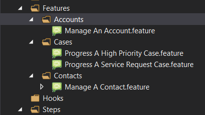
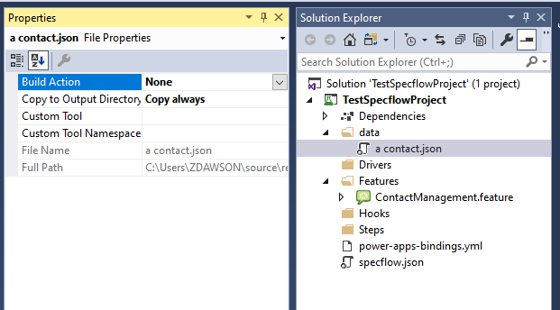

Summary: A lab to create and explore basic scenarios using existing bindings.
URL: /CodeLabs/
Category: Automated Testing
Environment: Web
Status: Draft
Feedback Link:
Analytics Account:
Authors: Zoe Dawson and Matthew Hoy
id: Usage

# Using Capgemini Bindings

## Exercise 1 - Key Steps

The first scenario in this lab will involve verifying that a basic user can view the contact form. This will entirely rely on the Capgemini PowerApps Bindings, so no custom steps will be created. Before undertaking this exercise, manually create a contact in your test environment.

Right click the “Features” folder in the project and create a new SpecFlow Feature file named Manage A Contact.feature.


Once created, specify the Feature name within the file as “Manage A Contact”. Next comes the definition of a particular scenario for the feature. In this example we will be defining the “Basic user views contact information” scenario. Scenario names we recommend follow a naming convention of &lt;Persona> &lt;Verb> &lt;Object>. With this scenario you can see this as &lt;Basic User> &lt;views> &lt;the contact forms>. Below is a table giving a brief overview of this.

<table>
  <tr>
   <td><strong>Placeholder</strong>
   </td>
   <td><strong>Description</strong>
   </td>
  </tr>
  <tr>
   <td>Persona
   </td>
   <td>Actor performing the action
   </td>
  </tr>
  <tr>
   <td>Verb
   </td>
   <td>The action
   </td>
  </tr>
  <tr>
   <td>Object
   </td>
   <td>The target of the action
   </td>
  </tr>
</table>


```
Feature: Manage A Contact

Scenario: Basic user views the contact forms
```

After defining the scenario, steps can be added to describe the user journey. Steps in SpecFlow begin with Given, When, And or Then keywords. When typing out steps in a feature file, IntelliSense should recommend any matching steps for the given keyword. In this scenario the following user story should be followed:

```
Given I log into the app as a basic user
When I navigate to the Contacts subarea
And I open the first record
Then I can see the contact form
```

Now attempt to find an appropriate step in the Capgemini Bindings via IntelliSense or [GitHub repository](https://github.com/Capgemini/powerapps-specflow-bindings/tree/master/bindings/src/Capgemini.PowerApps.SpecFlowBindings/Steps) for each of the above lines.

### Sample Answer

Below is a sample answer for this exercise. These steps most closely match the sample user story and therefore work well for BDD.


```
Feature: Manage A Contact

Scenario: Basic user views the contact forms
	Given I am logged in to the 'UI Test App' app as 'a basic user'
	When I open the sub area 'Contacts' under the 'Organisation Details' area
	And I open the record at position '0' in the grid
	Then I am presented with a 'Contact' form for the 'contact' entity

```

A major downfall of the above test is that it relies on manually created data. If this test were run on a clean organisation with no data, it would fail even though the functionality may be working as intended. The solution to this issue is to have the test create all of the data that it needs for the test to run successfully.

## Exercise 2 - Updating form data

Now that we know how to open a record the next step would be changing the values on the form. Let’s say for example we had a user story that covers updating the email address field for the contact record.

```
Given I log into the app as a basic user
When I navigate to a Contact record
And I update the contacts email address and save
Then the new email address is retained.
```

Based on this new story you can see that we need a new test scenario to cover updating the email field as the user journey is not the same as with the test we’ve already written. 

When it comes to organising your test scenarios the general recommendation we would give is that you sort your feature files by Entity type into folders and then into features by the user journey. This may not work for every project, we don’t want your folders to be overly specific or too broad. It might make sense on your project to group feature files by Epic or Feature for example. An example of what this may look like is below.



In this case the user story is covering a scenario that fits inside the ‘Manage A Contact’ feature so we would simply add a new scenario into that feature file. For more best practice conventions you can read [this blog.](https://specflow.org/blog/gherkin-conventions-for-readable-specifications/)

Now try creating a new scenario that opens a contact form then populates a value in the Email Address field and saves. Note that in the vast majority of cases you will need to know the field’s logical name to do this, rather than the display name. Now attempt to find the appropriate steps in the Capgemini Bindings via IntelliSense or the [GitHub repository](https://github.com/Capgemini/powerapps-specflow-bindings/tree/master/bindings/src/Capgemini.PowerApps.SpecFlowBindings/Steps). 

### Sample Answer

Below is a sample answer for this exercise.

```
Scenario: Basic user updates the contact email
	Given I am logged in to the 'UI Test App' app as 'a basic user'
	When I open the sub area 'Contacts' under the 'Organisation Details' area
	And I open the record at position '0' in the grid
	And I enter 'tomjones@google.com' into the 'emailaddress1' text field on the form
	And I save the record
	Then I can see a value of 'tomjones@google.com' in the 'emailaddress1' text field
```

## Exercise 3 - Table Methods

This exercise will cover a scenario in which you need to populate or validate a large number of the same thing. Let’s say for example you were working with this user story.

```
Given I log into the app as a basic user
When I open a contact record
Then I can see the Job Title, Email, Business Phone, Mobile Phone and Fax fields to capture contact details
```

Using what we have already learnt we could create a scenario that executes this line by line as follows.

```
Scenario: Basic user validates the contact form fields
	Given I am logged in to the 'UI Test App' app as 'a basic user'
	When I open the sub area 'Contacts' under the 'Organisation Details' area
	And I open the record at position '0' in the grid
	Then I can see the 'jobtitle' field
	And I can see the 'emailaddress1' field
	And I can see the 'telephone1' field
	And I can see the 'mobilephone' field
	And I can see the 'fax' field
```

Hopefully you will agree that while this would work it’s not the most easy to read and understand and could be improved. Here we turn to table methods. Table methods are a way of structuring your data inputs into the form of a table so that one step binding is repeated for each row in the table. Table methods have some specific formatting rules you need to pay attention to, for one you will need to create a row containing the table headers. In the case of SpecFlow and the PowerApps Bindings there will be some variables defined inside the step definition that will correspond to your table headers. 

```
[When(@"I enter the following into the quick create")]
public static void WhenIEnterTheFollowingIntoTheQuickCreate(Table fields)
{
    fields = fields ?? throw new ArgumentNullException(nameof(fields));

    foreach (TableRow row in fields.Rows)
    {
        WhenIEnterInTheFieldOnTheQuickCreate(row["Value"], row["Field"], row["Type"]);
    }
}
```

In this example you can see the table headers that would be needed within the foreach loop “Value”, “Field” and “Type”. If the step definition does not explicitly define a table header for you in this way you can just use anything you’d like, just make sure it makes sense in the context of your scenario.

When it comes to putting this data down in your scenario each “cell” of the table needs to be surrounded with |’s. To use the previous example we would write the table as follows:

```
When I enter the following into the quick create
	| Value | Field      | Type  |
	| 12345 | telephone1 | field |
```

SpecFlow will format your table for you when you place your |’s on each side of your cells so you don’t have to worry about making it look neat. 

Now go through the Capgemini Bindings via IntelliSense or the [GitHub repository](https://github.com/Capgemini/powerapps-specflow-bindings/tree/master/bindings/src/Capgemini.PowerApps.SpecFlowBindings/Steps) and see if you can find a step binding to cover checking that the fields in the story are there and editable. 

### Sample Answer

Below is a sample answer for this exercise.

```
Scenario: Basic user validates the contact form fields
	Given I am logged in to the 'UI Test App' app as 'a basic user'
	When I open the sub area 'Contacts' under the 'Organisation Details' area
	And I open the record at position '0' in the grid
	Then I can edit the following fields
	| fields        |
	| jobtitle      |
	| emailaddress1 |
	| telephone1    |
	| mobilephone   |
	| fax           |
```

## Exercise 4 - Backgrounds

You may have noticed that so far all of our scenarios repeat the same 3 steps at the start:

```
Given I am logged in to the 'UI Test App' app as 'a basic user'
When I open the sub area 'Contacts' under the 'Organisation Details' area
And I open the record at position '0' in the grid
```

Now there are a couple of ways that we can go about streamlining this, one way that will be covered later could be writing a custom step binding to do all of these actions as part of 1 step. What we’re going to cover here though is some out of the box SpecFlow functionality: Feature Backgrounds. 

Feature backgrounds allow us to define a shared set of steps that every scenario in a feature file will follow when the test is executed. It is important to note that you cannot exempt any of your scenarios from running the feature background steps so be sure when you add background steps that they definitely apply to _all _of your scenarios or you may be creating problems for yourself. 

You can add a background to your scenario by simply adding \

```
Background: 
```

After you name your feature and before your scenarios start. Try updating your Manage A Contact feature file now to include a set of background step instead of repeating the same step bindings in each scenario.

### Sample Answer

Your feature file should now look something like this:

```
Feature: Manage A Contact

Background: 
	Given I am logged in to the 'UI Test App' app as 'a basic user'
	When I open the sub area 'Contacts' under the 'Organisation Details' area
	And I open the record at position '0' in the grid

Scenario: Basic user views the contact forms
	Then I am presented with a 'Contact' form for the 'contact' entity

Scenario: Basic user updates the contact email
	When I enter 'tomjones@google.com' into the 'emailaddress1' text field on the form
	And I save the record
	Then I can see a value of 'tomjones@google.com' in the 'emailaddress1' text field

Scenario: Basic user validates the contact form fields
	Then I can edit the following fields
	| fields        |
	| jobtitle      |
	| emailaddress1 |
	| telephone1    |
	| mobilephone   |
	| fax           |
```

## Exercise 5 - Creating a Contact

This exercise will cover automatic creation of test data, to ensure that the running of the test will not be reliant on data already existing in the system. Before beginning this exercise ensure that there are no contacts in the My Active Contacts view for your Dynamics user.

Create a folder named “Data” in the root of the test project and add a new json file within the folder named “a contact.json”.


Open the newly created json file and add the following information

```
{
  "@logicalName": "contact",
  "@alias": "a contact",
  "firstname": "Tom",
  "lastname": "Jones"
}
```

The above json specifies that a contact record will be created with the name of “Tom Jones”. The @alias value is used to reference this record in feature or other json files. Ensure that the json file properties in your data folder are set to “Copy if Newer” or “Copy Always”.



The next step is to add a step in the feature file to create this contact record. Now attempt to find an appropriate step in the Capgemini Bindings via IntelliSense or [GitHub repository](https://github.com/Capgemini/powerapps-specflow-bindings/tree/master/bindings/src/Capgemini.PowerApps.SpecFlowBindings/Steps) for each of the below lines in the sample user story.

```
Given I log into the app as a basic user
And a contact has been created
When I navigate to the Contacts subarea
And I open the first record
Then I can see the contact form
```

### Sample Answer

```
Feature: Contact Management

Scenario: Basic user views created contact information
	Given I am logged in to the 'UI Test App' app as 'a basic user'
	And I have created 'a contact'
	When I open the sub area 'Contacts' under the 'Organisation Details' area
	And I open the record at position '0' in the grid
	Then I am presented with a 'Contact' form for the 'contact' entity
```

## Exercise 6 - Creating a Randomized Contact

The Capgemini PowerApps Bindings also include support for randomised data using Faker. Update the contact json used in Exercise 1 with the following faker attributes for first name and last name:

```
{
    "firstname": "{{name.firstName}}",
    "lastname": "{{name.lastName}}"
}
```

Run the test scenario out of headless mode by updating the headless attribute to “false” in the power-apps-bindings.yml file, to verify that the contact first name and last name are being randomised successfully.

### Sample Answer

Your “a contact.json” file should now look like this:

```
{
  "@logicalName": "contact",
  "@alias": "a contact",
  "firstname":  "{{name.firstName}}",
  "lastname":  "{{name.lastName}}" 
}
```

## Exercise 7 - Creating Hierarchical Data

The data files you have already created can be further improved to cover more detailed data setup requirements without necessitating adding in large numbers of data files and steps in your scenario as below.

```
And I have created 'a contact'
```

One way in which we can do this is by adding related/child entities into the data file for a given record. This can be done in multiple ways, for example if we wanted to create an Account record linked to a contact record in the Primary Contact field we could reuse the data file you have created for exercise 2 as follows by using its alias in the data file.

```
{
  "@logicalName": "account",
  "@alias": "an account",
  "name": "Test Account",
  "primarycontactid@alias.bind": "a contact"
}
```

In the above example you can see that by adding ‘@alias.bind’ to the field we want to populate with data from another file we can just use the alias name of the data file we’re referencing. When creating data this way it is important to remember that for the test to be able to use the data it has to be created before the test tries to create the record referencing it. In this example that means we need to create the contact record before the account record as follows.

```
Given I am logged in to the 'UI Test App' app as 'a basic user'
And I have created 'a contact'
And I have created 'an account'
```

The second way in which we can create child records is by populating the data for the child record directly inside the data file. If we again use the account and primary contact example this means adding the ‘firstname’ and ‘lastname’ fields as the data for the ‘primarycontactid’ field as follows.

```
{
  "@logicalName": "account",
  "@alias": "a hierarchical account",
  "name": "Test Account",
  "primarycontactid": {
    "@alias": "a child account",
    "firstname": "Tom",
    "lastname": "Jones"
  }
}
```

You might notice in the above example that I have added an alias to the contact record we’re creating in this new way. This works much the same as any other alias and can now be called at a later data in other data files or in feature files. Creating the data this way means we no longer need to chain creating data files in our test scenario which would now look like this.

```
@Regression
Scenario: Basic user creates hierarchical test data
	Given I am logged in to the 'UI Test App' app as 'a basic user'
	And I have created 'a hierarchical account'
```

Your task now will be to try and write a test scenario in which a basic user logs into dynamics and the API creates an Account record with a primary contact set and 2 child lead records using only 1 data file. Your test scenario should then navigate to and open the account record. To help you on the way, when creating multiple records for a 1-to-many relationship, instead of a field name in your data file you use the relationship name. Don’t forget it’ll be an array of leads.

### Sample Answer

Your data file should look something like this:

```
{
  "@logicalName": "account",
  "@alias": "a hierarchical account",
  "name": "Test Account",
  "primarycontactid": {
    "@alias": "a child account",
    "firstname": "Tom",
    "lastname": "Jones"
  },
  "lead_customer_accounts": [
    {
      "firstname": "lead",
      "lastname": "number 1"
    },
    {
      "firstname": "lead",
      "lastname": "number 2"
    }
  ]
}
```

Your test scenario should look something like this:

```
@Regression
Scenario: Basic user creates hierarchical test data
	Given I am logged in to the 'UI Test App' app as 'a basic user'
	And I have created 'a hierarchical account'
	When I open the sub area 'Accounts' under the 'Organisation Details' area
	And I open the record at position '0' in the grid
	Then I am presented with a 'Account' form for the 'account' entity
```

## Exercise 8 - Extending Existing Data

Using the Capgemini PowerApps bindings an existing json file can be extended using the @extends tag. Create a folder within the data folder of the project named “a contact”. Within this folder create a json file named “with a birthday.json”.

```
{
  "@extends": "../a contact",
  "birthdate": "1997-01-30"
}
```

Now create a scenario in the test feature file based on the following user story.

```
Given I log into the app as a basic user
And a contact with a birthday has been created
When I navigate to the Contacts subarea
And I open the first record
And I open the Details tab
Then I can see the contact's birthday
```

### Sample Answer

Below is a sample answer for the above user story. Note that although the data format is different, the Capgemini Bindings compare dates based on actual value rather than format.

```
Scenario: Basic user views a contact birthday
	Given I am logged in to the 'UI Test App' app as 'a basic user'
	And I have created 'a contact with a birthday'
	When I open the sub area 'Contacts' under the 'Organisation Details' area
	And I open the record at position '0' in the grid
	And I select the 'Details' tab
	Then I can see a value of '1997-01-30' in the 'birthdate' datetime field
```

## Exercise 9 - Impersonating Users

The Capgemini PowerApps bindings can also be used to impersonate users when creating data. This is useful when it is expected that data will be created by a non standard user or an integration with another application. To impersonate a user, an applicationUser entry in the power-apps-bindings.yml file is required, as well as the username of the user to impersonate.

Now create a scenario called “Basic user validates contact owner” that logs into the app as “a basic user” but uses “an impersonated user” to create “a contact with a birthday”. Then, the scenario should check that the owner field is set to the user of “an impersonated user”.

### Sample Answer

Below is a sample scenario meeting the above requirements

```
Scenario: Basic user validates contact owner
	Given I am logged in to the 'UI Test App' app as 'a basic user'
	And 'an impersonated user' has created 'a contact'
	And I have opened 'a contact'
	Then I can see a value of 'Matthew Hoy' in the 'ownerid' lookup header field
```