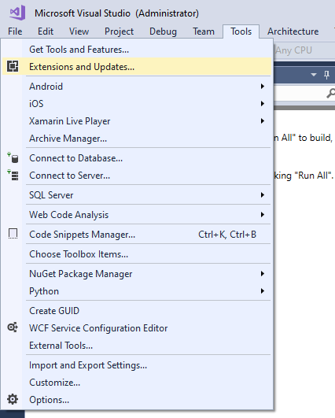
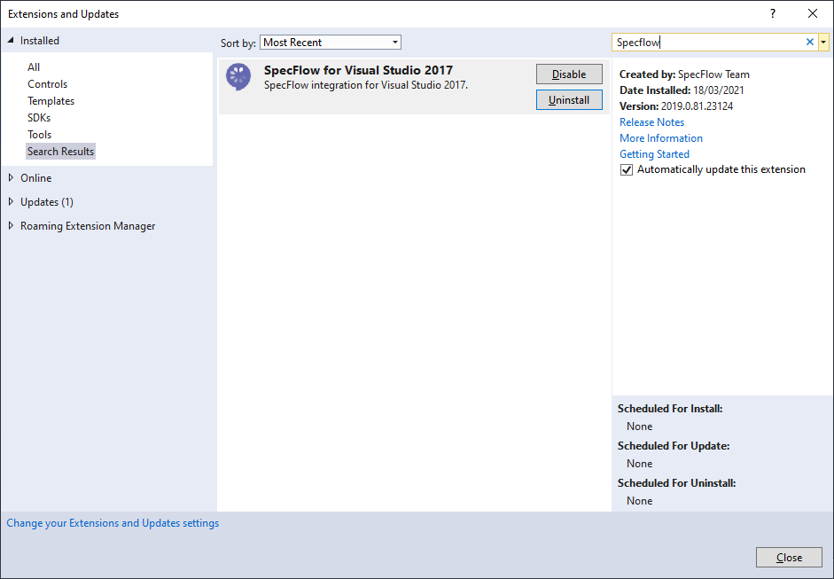
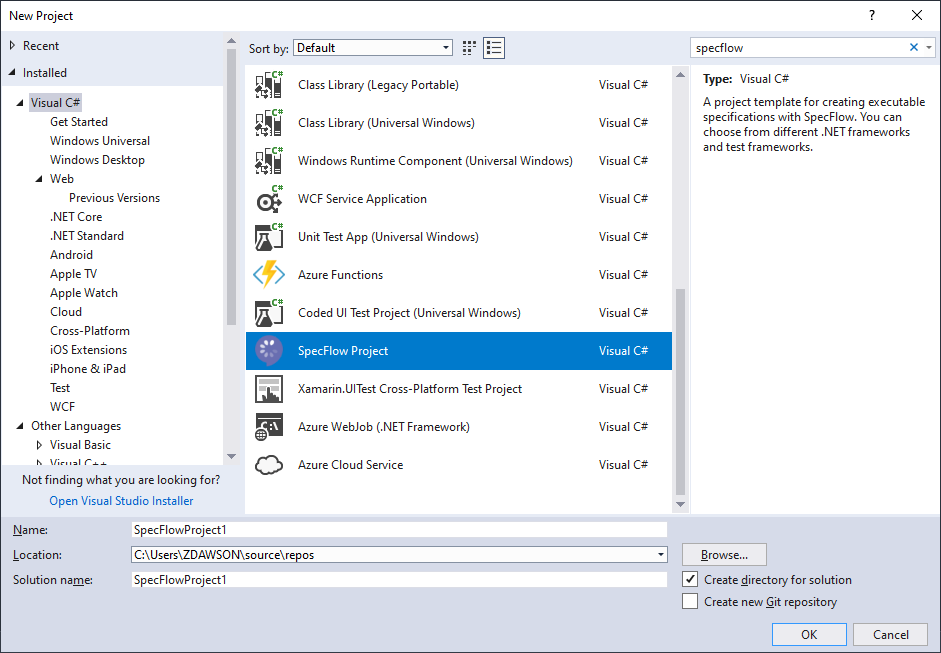
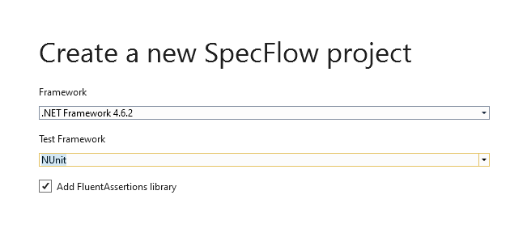
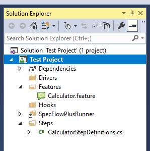
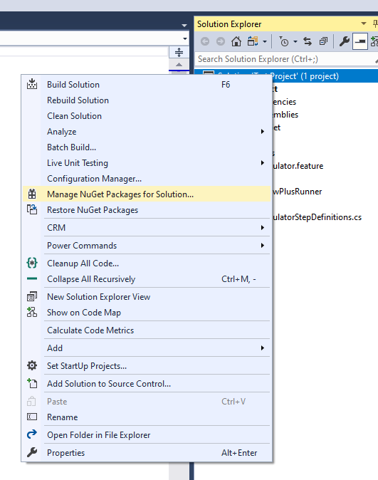
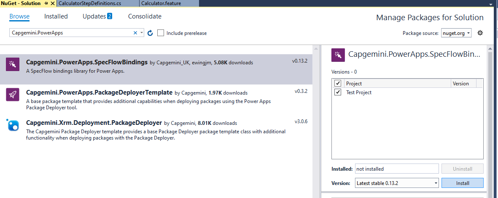
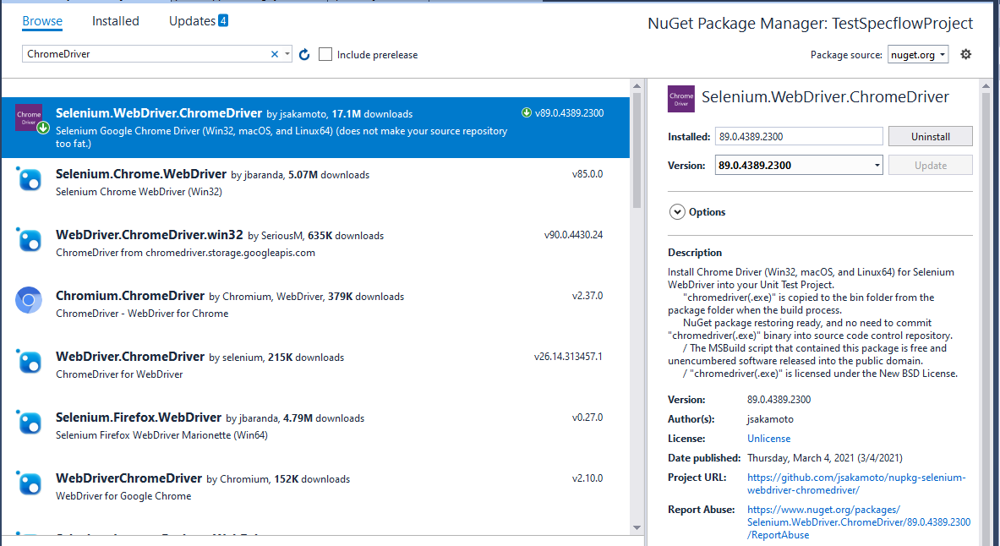
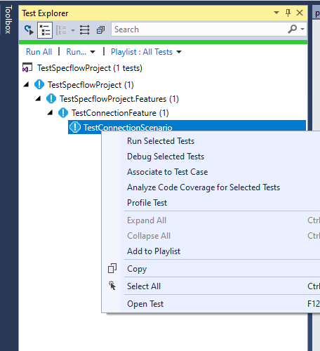
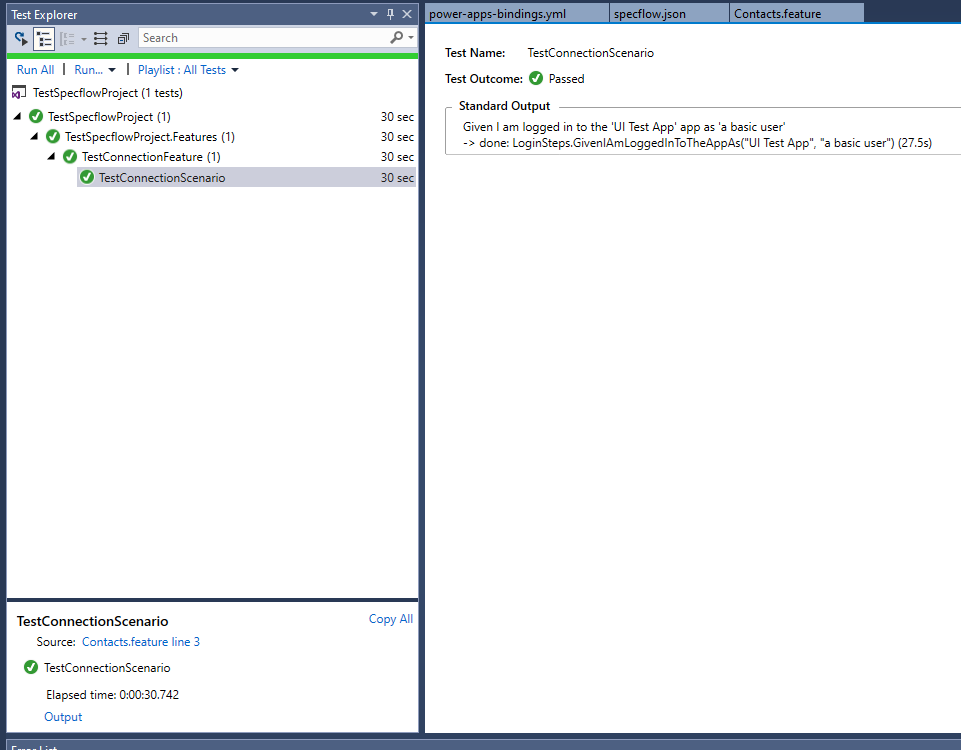

Summary: A lab to set up a new automated UI testing project using EasyRepro.
URL: /CodeLabs/
Category: Automated Testing
Environment: Web
Status: Draft
Feedback Link: 
Analytics Account:
Authors: Zoe Dawson and Matthew Hoy
id: Setup

# Installing the SpecFlow Visual Studio Extension

The first step in creating a new automated UI testing project is ensuring that the Specflow extension for Visual Studio has been installed. Do this by navigating to Tools and opening the Extensions and Updates window.





Next, navigate to the “Online” tab on the left of the window, search for “SpecFlow” in the search bar and install “SpecFlow for Visual Studio 2017/2019”.





Visual Studio may require a restart to complete installation of the extension.


# Creating a Project


## A New SpecFlow Project

Once the SpecFlow extension has been installed, the option to create a SpecFlow project will be available from the New Project dialog. It can be found under the Visual C# root menu. Enter an appropriate name and location and click Ok.





A dialog will then be displayed with configuration options for the SpecFlow project. Set the Framework to 4.6.2 and the Test Framework to NUnit.





The solution will then be opened with the standard folder structure for a SpecFlow project, and some test files which can be deleted. Visual Studio should have also resolved the required NuGet packages for the project.





## Installing Capgemini.PowerApps.Bindings

The next step in creation of the project is installing the Capgemini PowerApps Bindings from NuGet. This can be done either through the command line or through the UI.


### Command Line

Enter the following into the Package Manager Console in Visual Studio:


```
PM> Install-Package Capgemini.PowerApps.SpecFlowBindings
```


### UI

Right click on the new solution in Solution Explorer and click “Manage NuGet Packages for Solution”.




Once the NuGet Package Manager window has opened, click the Browse tab and search for “Capgemini.PowerApps.Bindings”. Select the package, right click the SpecFlow project and click Install.





### Capgemini Project Setup

Once the NuGet package has been installed, create a SpecFlow Configuration JSON file named specflow.json in the root of the project. The below code must be added to the specflow.json file to allow the external bindings to be used in the project. Create or update the specflow.json file with the below code.


```
{
    "stepAssemblies": [
        { "assembly": "Capgemini.PowerApps.SpecFlowBindings" }
    ]
    //additional json attributes as required
}
```


Next, create a file called “power-apps-bindings.yml” in the root directory of the project. This is the file used to configure settings used by the Capgemini.PowerApps.Bindings project.


### Driver Setup

To set up a driver for the project, install your preferred browser driver via NuGet. This lab will be using ChromeDriver.





# Connecting to a Dynamics Instance

Connecting to Dynamics is handled by the Capgemini bindings, using the login and data setup steps. The connection is configured using the power-apps-bindings.yml file. It is recommended to use environment variables in this file rather than actual values, to avoid storing sensitive information in a shared repository. Create or update the  power-apps-bindings.yml file with the following information:


```
url: SPECFLOW_LAB_URL
browserOptions:
  browserType: Chrome #If using another driver, update this here
  headless: true
  width: 1920
  height: 1080
  startMaximized: false
applicationUser:
  tenantId: SPECFLOW_LAB_TENANTID
  clientId: SPECFLOW_LAB_CLIENTID
  clientSecret: SPECFLOW_LAB_CLIENTSECRET
users:
  - username: SPECFLOW_LAB_USERNAME
    password: SPECFLOW_LAB_PASSWORD
    alias: a basic user
  - username: SPECFLOW_LAB_IMPERSONATED
    alias: an impersonated user

```


## Environment Variables

The environment variables for this lab should be set to the details of the test Dynamics instance provided. Visual Studio must be restarted for changes to environment variables to take effect.


## BrowserOptions

The parameters in the browserOptions section are used to determine how the tests will be executed. For this lab, ChromeDriver will be used, so the browserType is set to Chrome. The headless parameter defines whether the test will be visible to the user in a Chrome window when running. When using automated UI testing as part of a DevOps pipeline, this should always be set back to true before committing to the repository. However, changing this setting to false is a useful way to debug failing or flaky tests.


## Users

The application user in this instance must have the permissions to impersonate users, and uses a client id and secret rather than username and password. Users to be impersonated do not require a password in the yml file.


## Testing the Dynamics Connection

The Dynamics connection can be tested by creating a scenario and including the below step:


```
Given I am logged in to the 'UI Test App' app as 'a basic user'
```


To do this, create a new SpecFlow Feature file in the Features folder of the project as below: 


```
Feature: Test Connection

Scenario: Test Connection Scenario
	Given I am logged in to the 'UI Test App' app as 'a basic user'
```


Now build the project and run this scenario using the Test Explorer window in Visual Studio.





After around 30 seconds the test should pass; clicking the test and opening the “Output” link in the test summary should show that the step in the scenario was successfully completed.





This proves that the connection to Dynamics was successful and the environment variables have been set correctly.
