id: alm-developer-hub
summary: Install and configure Development Hub.
categories: ALM
environment: Web
status: Draft
authors: Luke Phillips and Tom Ashworth

# Install and configure Development Hub

## Introduction

In this lab, you will install and configure Development Hub in your newly created Development environment which should take approximately 10-15 minutes. Development Hub was developed by a member of our team to support a team's development workflow by extracting an individual's changes to the Master environment then the entire package into source control. This approach avoids taking other developers unfinished changes while working in a shared environment.

To learn more, explore the project's [GitHub repository](https://github.com/ewingjm/development-hub) and release [blog post](https://medium.com/capgemini-microsoft-team/continuous-integration-for-power-apps-the-development-hub-7f1b4320ecfd?source=friends_link&sk=c5034f278e70bfd9aa2dce502dd490d9).

### What you will do
- Create the required Flow Connections in the Maker Portal
- Install the Development Hub package into the Development environment
- Register your Azure DevOps project 
- Create new pipeline in Azure DevOps to support Development Hub
- Register your generated Git Repository
- Register your master environment
- Register your solution

### Prerequisites

- At least two Power Platform Environments (with databases and system administration access)
- An already setup Azure DevOps Project (see [Tutorial - Generate a new project]())

These should be covered by following the [Environment Setup]() lab.

## Create Flow Connections

Development Hub utilises two data connections, Approvals and Azure DevOps, which need to be first created before you can install the package.

Open the [Maker Portal](https://make.powerapps.com)

First, check you are within your Development environment which is displayed at the top right of the page. If you aren't, select the environment name and then your Development environment.

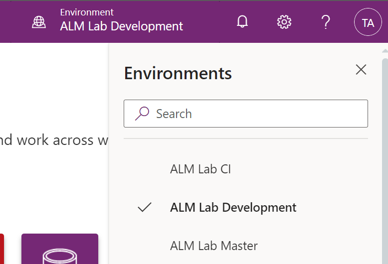

Next, use the left-hand side navigation and select **Data** then **Connections**.

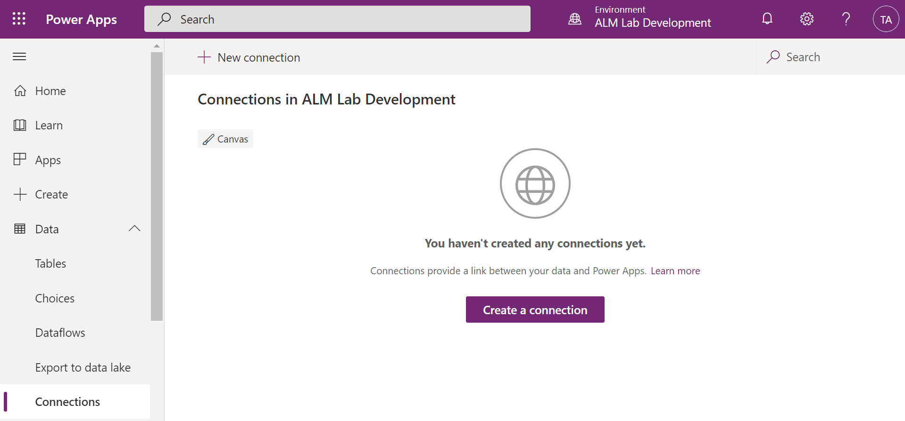

Now to create our connections by selecting **New Connection** and search for **Approvals** if you don't see it in the list. 
Click the plus button next to it then **Create** in the open dialog.

Once successful, repeat the previous instruction searching for **Azure DevOps**. 

Important: This connection must be signed into an account with access to your Azure DevOps project - in many cases our clients have separate development tenants and production which have different accounts. If this is the case for you, a suggestion is to ensure you are signed into that Azure DevOps project in the same browser window you signed into the Power Platform. Please see this [GitHub issue](https://github.com/ewingjm/development-hub/issues/69) for more details if you face this problem.

You will know you are successful if the Connection name has the expected email address.


In the next step, you'll need the Connection IDs which can be retrieved by opening up each Connection and copying the `connectionid` segment from the URL.

`environments/{environmentid}/connections/{apiname}/{connectionid}/details`.

## Deploy the package

Now that the required connections are created, let's install the Development Hub package.

First, download the latest package by following [this](https://github.com/ewingjm/development-hub/releases) link to the Releases on GitHub. For the latest release, expand the assets and download the first zip file.

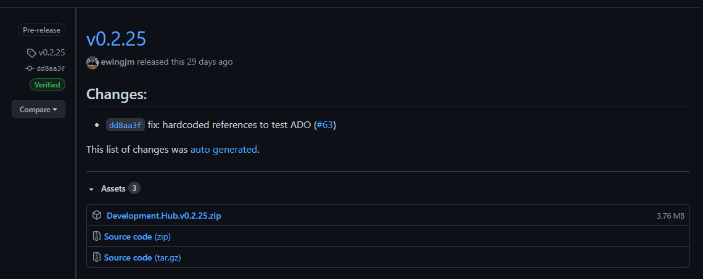

Once downloaded, unzip the file and open the 'Development Hub' folder inside.

Follow Microsoft's guide to downloading and installing the PowerShell tools [here](https://docs.microsoft.com/en-us/power-platform/admin/deploy-packages-using-package-deployer-windows-powershell#import-the-package-deployer-powershell-module).

Copy the below PowerShell into a notepad and replace the four parameters and the package location denoted by `<...>`.

```
$conn = Get-CrmConnection -InteractiveMode

$settings = [PSCustomObject]@{
  'ConnRef:devhub_sharedapprovals_6d3fc' = '<the connection name of the Approvals connection>'
  'ConnRef:devhub_sharedvisualstudioteamservices_d7fcb' = '<the connection name of the Azure DevOps connection>'
  'AzureDevOpsOrganisation' = '<the name of the Azure DevOps organisation>'
  'SolutionPublisherPrefix' = '<the prefix of the publisher (without leading underscore)>'
}
$settingsArray = $settings.PSObject.Properties | ForEach-Object { "$($_.Name)=$($_.Value)" }
$runtimePackageSettings = [string]::Join("|", $settingsArray)

Import-CrmPackage -CrmConnection $conn -PackageDirectory '<location of Development Hub folder>' -PackageName 'DevelopmentHub.Deployment.dll' -RuntimePackageSettings $runtimePackageSettings -Verbose
```

For example:

```
$conn = Get-CrmConnection -InteractiveMode

$settings = [PSCustomObject]@{
  'ConnRef:devhub_sharedapprovals_6d3fc' = '949efd29db18486c862301a6aa3f581f'
  'ConnRef:devhub_sharedvisualstudioteamservices_d7fcb' = 'bf4cc65db89243e2aefcd4a86886b47e'
  'AzureDevOpsOrganisation' = 'cap-almlabs'
  'SolutionPublisherPrefix' = 'almlabs'
}
$settingsArray = $settings.PSObject.Properties | ForEach-Object { "$($_.Name)=$($_.Value)" }
$runtimePackageSettings = [string]::Join("|", $settingsArray)

Import-CrmPackage -CrmConnection $conn -PackageDirectory 'C:\Users\tashwort\Downloads\Development.Hub.v0.2.25\Development Hub' -PackageName 'DevelopmentHub.Deployment.dll' -RuntimePackageSettings $runtimePackageSettings -Verbose
```

Open a PowerShell command prompt as an administrator.

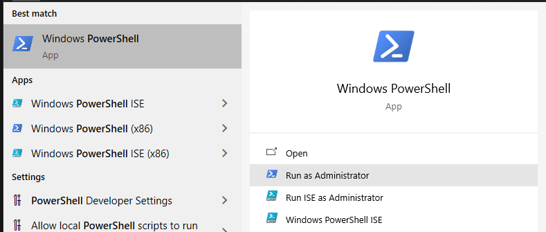

Copy your updated PowerShell script and paste it in the PowerShell command prompt. Press enter to run.

You'll be first asked to sign in. Select 'Display list of organisations' then 'Login'.

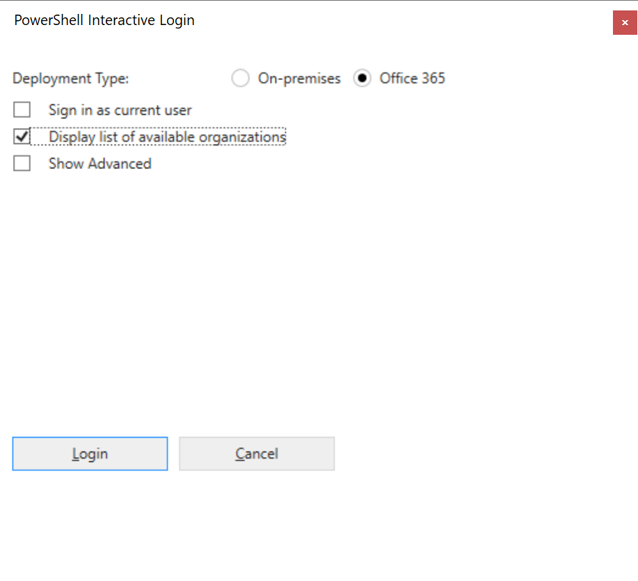

Enter your account details in the login prompt (it is sometimes hidden behind the window).

Select your development environment then 'Login'.

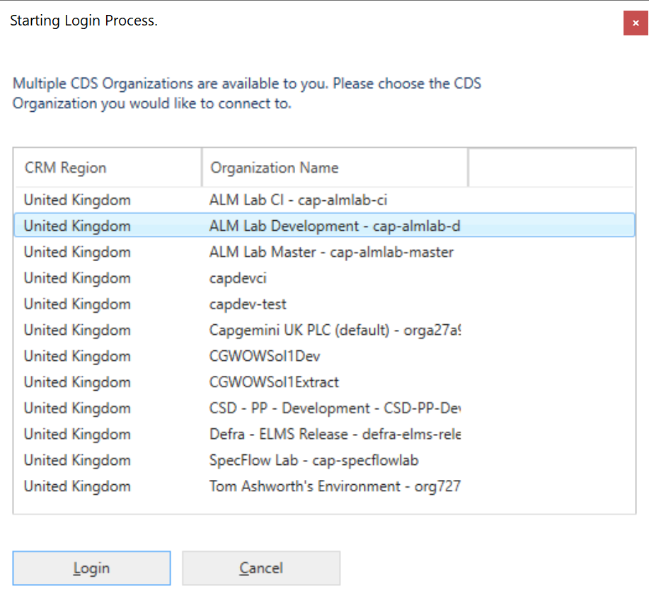

Wait for the install to complete with a successful result then close the PowerShell window.

```
PackageDeployer Information: 8 : Message: PackageTemplateBase.AfterPrimaryImport completed.
PackageDeployer Information: 8 : Message: User Code Execution : OP=AfterPrimaryImport : Status=Complete : Result=True : Duration=00:01:01.4212886
PackageDeployer Information: 8 : Message: Post-import process complete.--Complete
PackageDeployer Information: 8 : Message: User Code Execution : OP=DataImportBypass : Status=Execute
PackageDeployer Information: 8 : Message: User Code Execution : OP=DataImportBypass : Status=Complete : Duration=00:00:00.0008019
PackageDeployer Information: 8 : Message: ****** PACKAGE DEPLOYMENT PROCESS COMPLETED. Result:SUCCESS  Duration:00:06:13.2689684 ******
```

## Create the supporting extract pipeline within Azure DevOps

Development Hub requires a pre-made pipeline to handle the merge of extracted changes into the code repository.

First, open this [link](https://github.com/ewingjm/development-hub/blob/master/samples/scripts/Merge-SolutionMerge.ps1) and copy the contents into a new file within the repo in Azure DevOps created in Generate a new project lab. The file should be within a `scripts` folder and called `Merge-SolutionMerge.ps1`. Save the file and commit to the main branch.


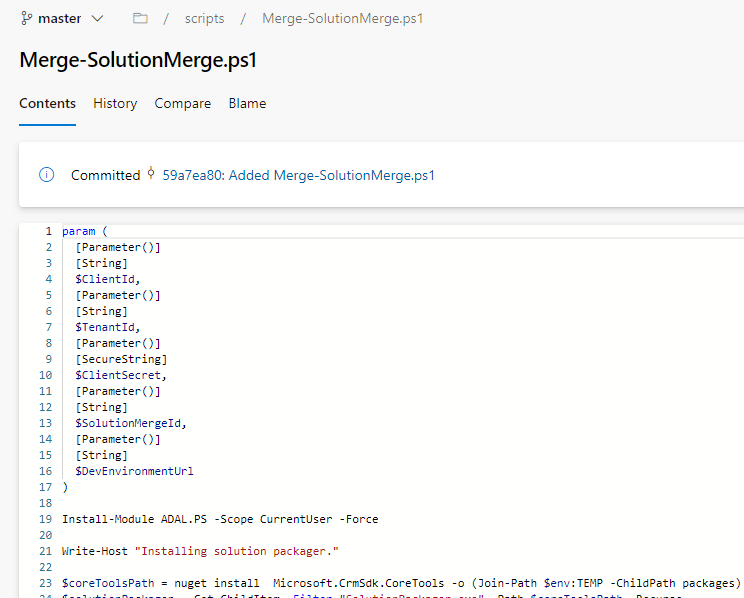

Next, open [this](https://github.com/ewingjm/development-hub/blob/master/samples/azure-pipelines-extract.yml) link to the pipeline template and copy the contents into a new file within a `pipelines` folder and called `azure-pipelines-extract.yml`. Save the file and commit to the main branch.

Now that you have the supporting files in the repo, you can create the build. Within Azure DevOps, go to the 'Pipelines' section then click 'New Pipeline'.

Select 'Azure Repos Git' then your repo.


Select 'Existing Azure Pipeline YAML file' then select the pipeline file you just created.


Then select 'Save', you don't need to run this.


Take note of the `definitionId` within the URL. For example `5` in the URL `https://dev.azure.com/cap-alm-lab/ALMLab/_build?definitionId=5`.

Next, you need to ensure that permissions are configured correctly for this repository on Azure DevOps. Navigate to Project Settings then Repositories in your Azure DevOps project. Select your repository and assign the following privileges to the project Build Service user:

- Contribute
- Contribute to pull requests
- Create branch

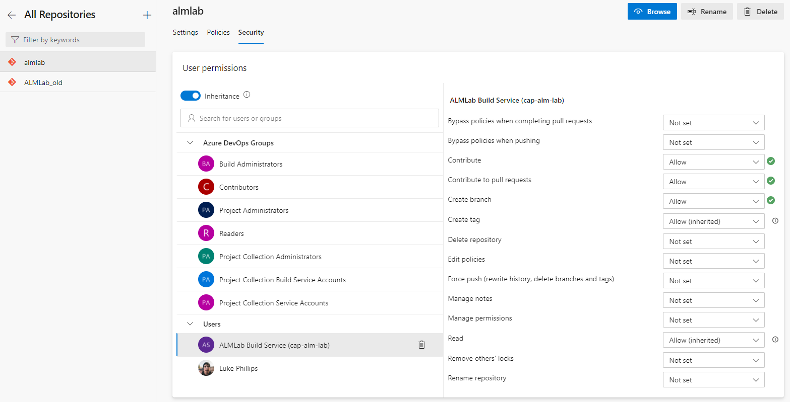

## Register your Azure DevOps project

Back in the Maker Portal, using the navigation on the left, click on 'Apps' then select the 'Development Hub' app.

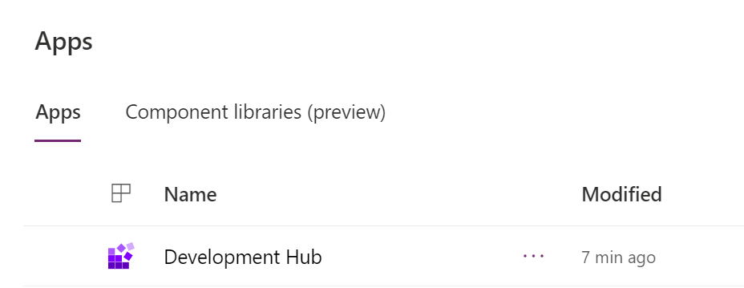

**_Welcome to Development Hub!_**

Next, select 'Projects' on the left then 'New' along the top.


This record only requires a name which should be the name of your Azure DevOps project. **The name can't be updated after the record is created and must match the project name on Azure DevOps.**


## Register your git repository

Next, register a Git repository within the project you've just created by creating a new Repository record.

| Field                       | Value Description                                                                                                         |
| --------------------------- | ------------------------------------------------------------------------------------------------------------------------- |
| Project                     | This should be pre-populated when creating from the Project record.                                                       |
| Name                        | The name **must** match the repository name on Azure DevOps and it **must** exist in the chosen project.                  |
| Extract Build Definition ID | The definition ID of the pipeline you just created.                                                                       |
| Target Branch               | The branch you would like to either push to or create pull requests into.                                                 |
| Source Control Strategy     | This should be 'Pull Request' for most projects although you can use 'Commit' if you don't intend to review code changes. |


Click 'Save and close' to confirm this.

## Register your master environment

The next step is to register the master environment by creating a new Environment record. Staying in Development Hub, select 'Environments' under 'Develop' on the left.


Select 'New' along the top then populate the following details.

| Field         | Value Description                                                                                         |
|---------------|-----------------------------------------------------------------------------------------------------------|
| Name          | This can be anything but 'Master' would be consistent.                                                      |
| URL           | This should be the URL of the Master Environment created in Environment Setup lab.                 |
| Tenant ID     | This should be the **Tenant ID** from the Azure App Registration created in Environment Setup lab.     |
| Client ID     | This should be the **Client ID** from the Azure App Registration created in Environment Setup lab.     |
| Client Secret | This should be the **Client Secret** from the Azure App Registration created in Environment Setup lab. |

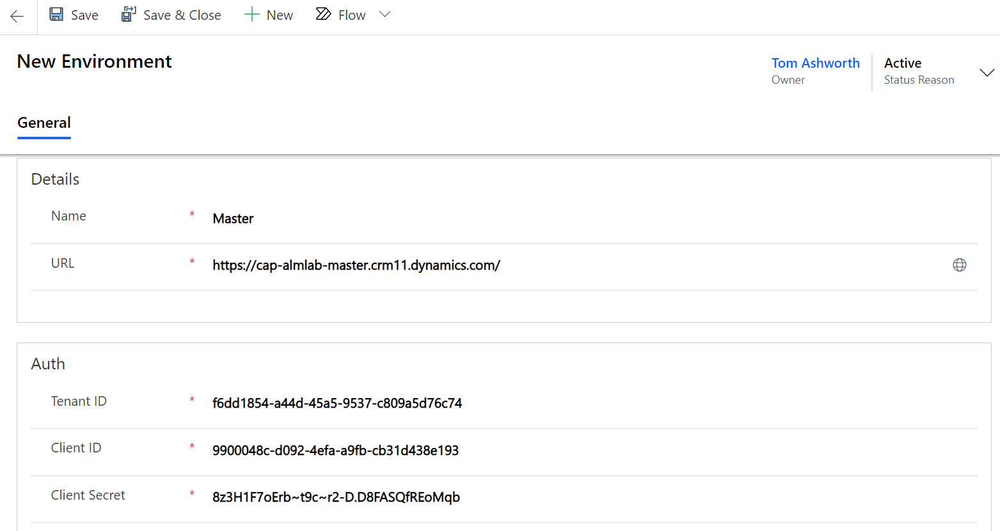

## Register your solution

The last step is to register a solution within a repository by creating a new Solution record. Go back to the Repository record you created ('Repositories' on the left then select the record you created) and find the 'Active Solutions' grid on the 'General' tab.

Click 'New Solution' and enter the following details.

| Field               | Value Description                                                                                                      |
| ------------------- | ---------------------------------------------------------------------------------------------------------------------- |
| Display Name        | This should be the Name of the solution created in Tutorial - Generate a new project.                                  |
| Unique Name         | This should be the Unique Name of the solution created in Tutorial - Generate a new project. E.g. `MACE_ALMLAB_Sample` |
| Description         | This can be anything.                                                                                                  |
| Staging Environment | This should be the Environment record you created in the last step.                                                    |
| Repository          | This should be pre-populated to the record you're on. E.g. `almlabs`                                                   |
| Version             | This should match the version of the solution created in the Master environment. E.g `1.0.0`                           |

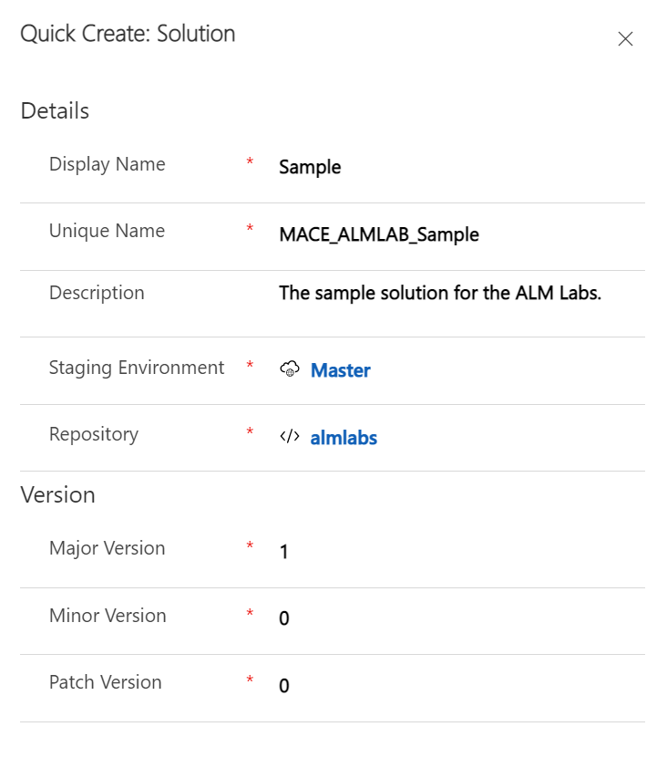

Click 'Save and Close' to confirm those values.
