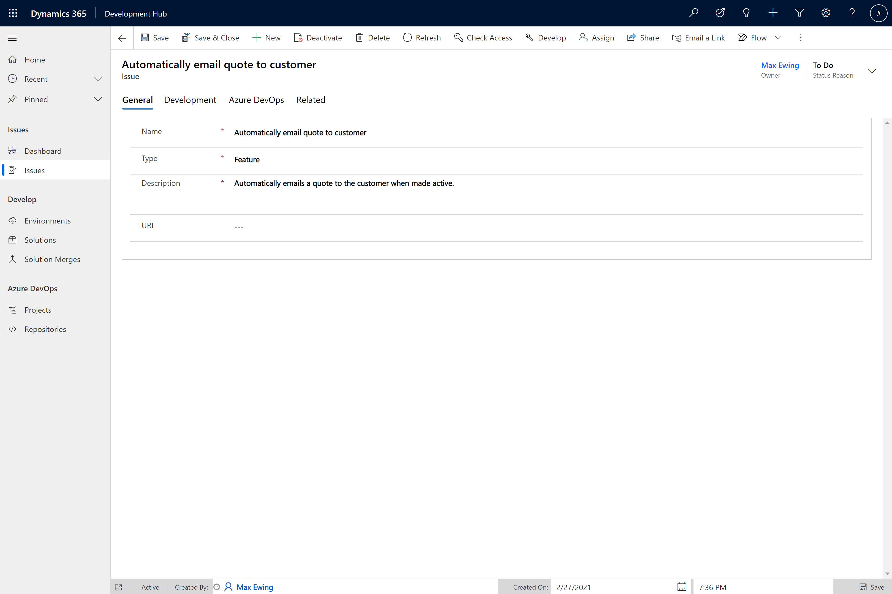

id: alm-development-hub-usage
summary: Development Hub usage.
categories: ALM
environment: Web
status: Draft
authors: Luke Phillips and Tom Ashworth

# Development Hub usage 

## Tutorial - Development Hub usage

This lab will take you through the functionality of Development Hub and it's usage.

## Create an issue

An Issue record must be created to begin working on a new feature or bug fix.

1. To create an Issue, Navigate to the Issues sub area under the Issues area
2. Click 'New'
3. You will then need to complete the following fields:

| Tab | Field | Example Value | Explanation |
|--|--|--|--|
| General | Name | Automatically email quote to customer  | The name of the issue. |
| General | Type | Feature | Either 'Feature' or 'Bug'. |
| General | Description | Automatically emails a quote to the customer when made active. | A longer description for the issue. |
| Azure DevOps | Work Item ID | 10001 | Used to link the commit to the correct Work Item in Azure DevOps |
4. Click 'Save'

## Develop the solution to the issue, make a change

## Request a merge

## Approve the merge

## Watch the process do it's magic - walk-through

# Create a further reading section in pages if applicable

### Trigger build

## Verify code changes are pulled down
