id: alm-development-hub-usage
summary: A lab to learn how to use Development Hub from creating a issue to seeing the change in CI.
categories: ALM
environment: Web
status: Draft
authors: Luke Phillips and Tom Ashworth

# Development Hub usage

## Tutorial - Development Hub usage

This lab will take you through the functionality of Development Hub and it's usage.

## Create an issue

An Issue record must be created to begin working on a new feature or bug fix.

1. To create an Issue, Navigate to the Issues sub area under the Issues area
2. Click 'New'
3. You will then need to complete the following fields:

| Tab          | Field        | Example Value                                                  | Explanation                                                      |
| ------------ | ------------ | -------------------------------------------------------------- | ---------------------------------------------------------------- |
| General      | Name         | Automatically email quote to customer                          | The name of the issue.                                           |
| General      | Type         | Feature                                                        | Either 'Feature' or 'Bug'.                                       |
| General      | Description  | Automatically emails a quote to the customer when made active. | A longer description for the issue.                              |
| Azure DevOps | Work Item ID | 10001                                                          | Used to link the commit to the correct Work Item in Azure DevOps |

4. Click 'Save'

## Develop the solution to the issue, make a change

In order to develop a solution to the Issue we created an unmanaged development solution is required. The unmanaged solution will be named using the name of the Issue.

1. Clicking the 'Develop' button in the command ribbon will trigger the creation of the unmanaged solution and set the status of the Issue to 'In Progress'.
   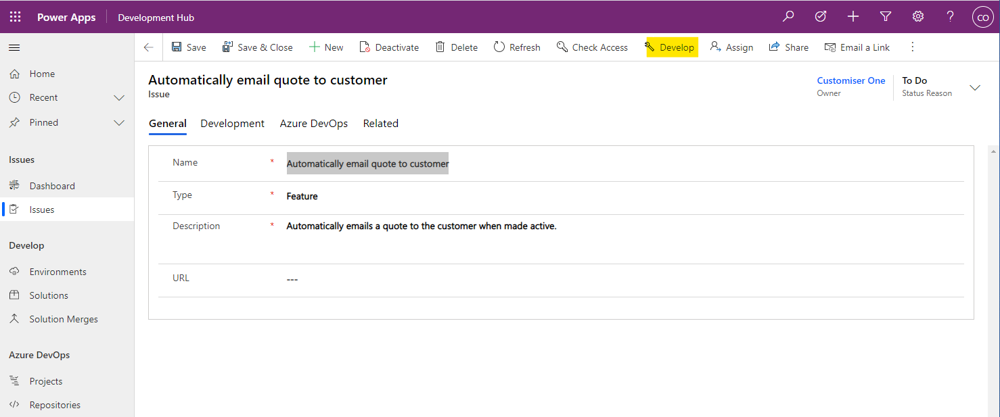

2. Open the [Power Platform Maker Portal](https://make.powerapps.com/) and select the environment which Development Hub is installed. To change environment you select the Environment dropdown in the top right corner of the portal.
   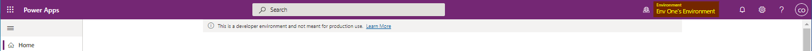

3. Select 'Solutions' from the navigation panel on the left side of the portal. This will display all the solutions installed into the environment. You will see a solution with a display name that matches the name given to the issue you created earlier. Clicking the display name will open the solution which will be empty.
   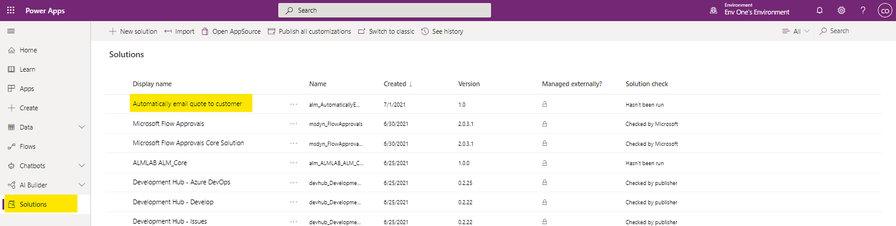

4. This is where you can add new and existing artifacts to your solution and make changes needed to resolve the Issue.
   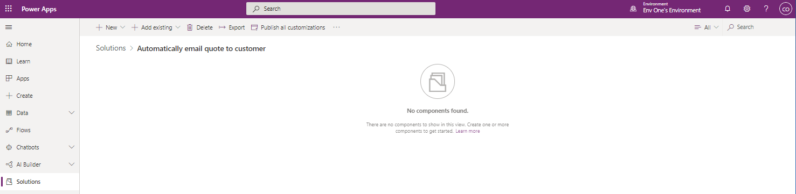

### Example - Add a new table

1. To add a new table, select the **+ New** button in the toolbar and select **Table** from the dropdown list.
   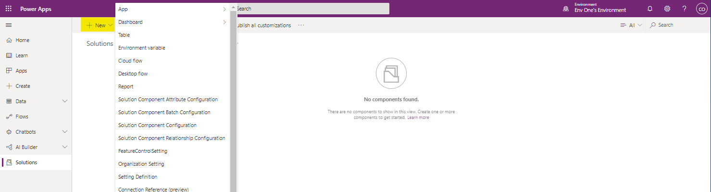

2. This opens a pane on the right side of the portal where you can define the properties of the new table.
   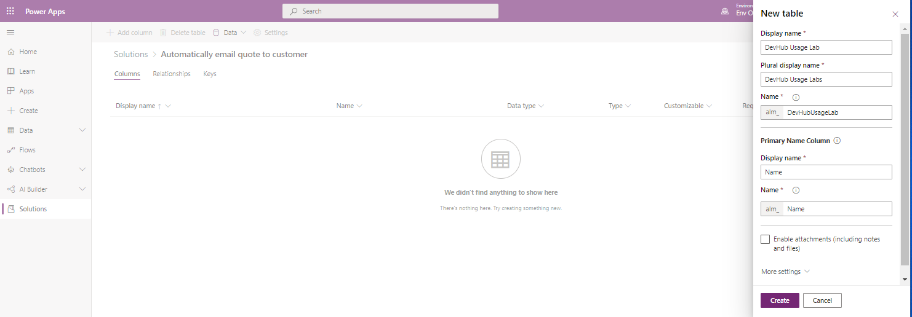

3. Once the table is created you will see a list of the standard Dataverse columns. You can now add further customisations to the table.

### Recommended steps to complete before requesting a merge

1. Run any potentially impacted tests locally against the development environment. This allows early identification of any issues that may have been introduced and is the optimum time to find and resolve issues.
2. If you are making code changes, raising a draft pull request so team members can give feedback is useful. This means your code review takes place outside of the solution merge process. If the code review happens during the merge process and issues are found then this will block other solution merges until you PR is approved.

## Request a merge

To add your changes to the master solution and have them deployed into the other environments you need to create a **Solution Merge**.

1. Open the **Development Hub** app, and navigate to the Issue. Select the **Development** tab where you will see a view called **Solution Merges**. Click **+ New Solution Merge**
   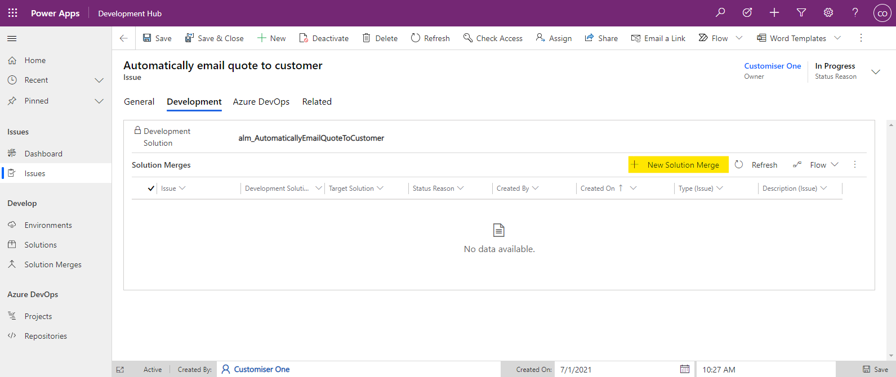

2. The **Quick Create: Solution Merge** pane will be displayed on the right side of the portal.

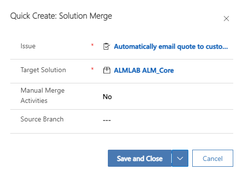

| Field                   | Example                               | Explanation                                                                                                                                                                                                                                                                                                                                                           |
| ----------------------- | ------------------------------------- | --------------------------------------------------------------------------------------------------------------------------------------------------------------------------------------------------------------------------------------------------------------------------------------------------------------------------------------------------------------------- |
| Issue                   | Automatically email quote to customer | Link to the related solution. This will already be populated.                                                                                                                                                                                                                                                                                                         |
| Target Solution         | ALMLAB ALM_Core                       | The solution to merge the changes into.                                                                                                                                                                                                                                                                                                                               |
| Manual Merge Activities | No                                    | Enabling the Manual Merge Activities will cause the merging process to pause before extracting and committing to source control. This is useful where you are merging changes by hand (e.g. where you need to delete components from the solution or modify a component not included in the development solution). _The "Performing a manual merge" section will detail this process further._ |
| Source Branch           | Empty                                 | If the solution to be merged has associated source code (e.g. you have made changes to plugin assemblies, web resources, tests or deployment logic) then you must provide the branch to be merged in here.  _If your repository uses a Push source control strategy, ensure that you perform any manual Git merging required on your source branch before creating the solution merge or you may get merge conflicts that prevent the solution merge being committed. It is recommended to use a Pull request strategy for this reason._|

3. You will now see a record in the **Solution Merges** view for the merge record you created.
   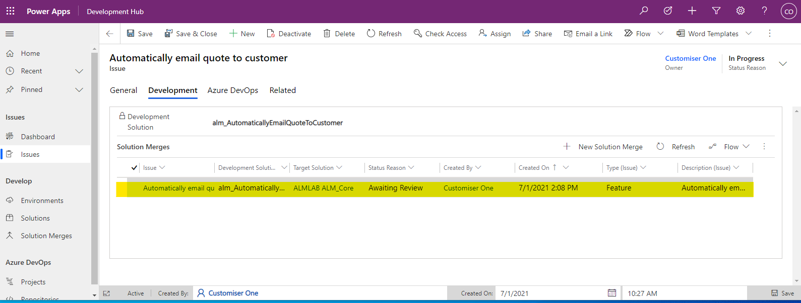

4. Select the record and click **Edit** or double click the row to open the **Solution Merge** form. You can now copy the URL and send it to someone to review and **Approve**.

## Approve the merge

To start the process of merging the developed changes into the master solution the **Solution Merge** record must be approved. On a project you would ask another team member to review your solution merge. When reviewing a merge some of the things to look out for are:

- Does the solution contain everything it would need to allow a merge to be successful. For example Dependencies, Plugin Steps etc.
- Does the solution contain items that it does not need. For example when adding an existing **Table** to your solution, did all the components unexpectedly get included?

1. Open the solution merge form and click **Approve** in the toolbar. This will change the **Status Reason** from **Awaiting Review** to **Approved**
   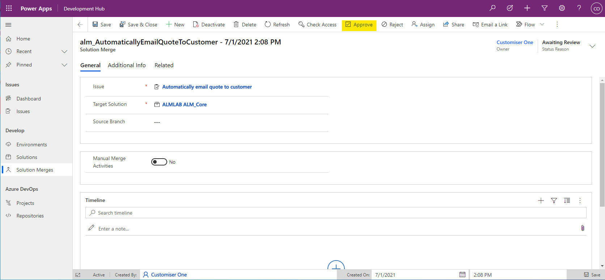

- If there are no solution merges in progress then the status reason will change to **Merging**. If another merge is in progress then it will be set to **Queued**. Queued solution merges will start as soon as the merges ahead of it have been complete.

- If the solution merge fails for any reason the **Status Reason** will be set to **Failed**. Details of the error will be added to the **Timeline**.

- Once a solution has been merged into master it is extracted into a branch with the same name as the **Issue** and A Pull Request is raised in Azure Devops with a link to the Work Item ID that was set on the Issue. The **Status Reason** of the solution merge is set to **Awaiting PR Merge**.

## Performing a manual merge

If Manual Merge has been enabled for the solution merge, then the merging process is paused to allow either the solution merge creator or approver to modify the target solution before it is extracted. This is useful for scenarios where the complete set of changes for a given issue couldn't be moved in an unmanaged solution. 

A great example of such a change would be deleting a component since there is no mechanism within an unmanaged solution to delete a component in the target environment. 

When the merging process is in a state where manual merge activities can begin, the solution merge will transition to an **Awaiting Manual Merge Activities** status and a Flow Approval is created for either the solution merge creator or approver to action. 

After the manual activities are complete, follow these steps to resume the merging process. 

1. Navigate to the Power Automate Maker Portal (e.g. https://unitedkingdom.flow.microsoft.com/)
2. Ensure you are in the correct environment (top left)
   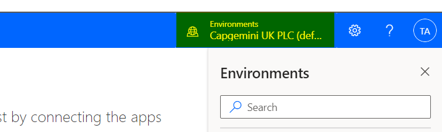
3. Select **Action Items** on the left then **Approvals**
   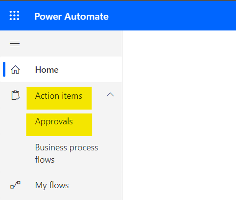
4. Select the created request in the list of "Received" requests
   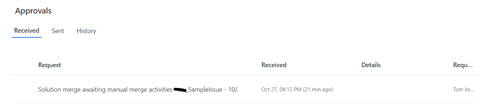
5. Select **Merged** as the response then **Confirm** to the bottom
   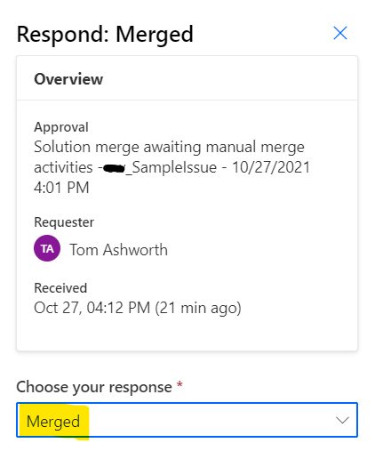
6. The merge will now resume by extracting the target solution from the master environment.

## Handling a merge failure

Not every merge will be successful and therefore an understanding of how to mitigate these proves valuable. This section will cover what Development Hub does to handle these and the steps required to retry the merge. 

Merging your development solution from dev to master could fail for a few reasons although the most common are:
- missing solution dependencies
- solution import timeout

In this event, the solution merge with transition into a **Failed** status and a note will be added to a the timeline. If the development solution failed to import the note will include import error resembling this note: 

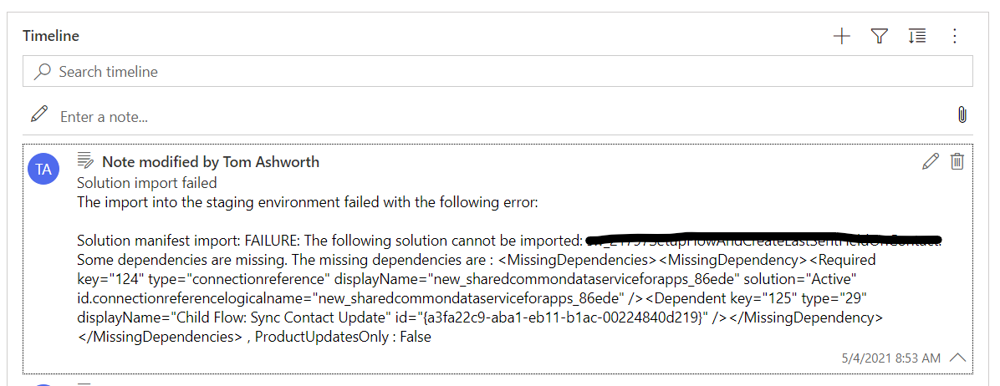

Otherwise, if any other error occurs, a more generic note is created with includes a link to the Cloud Flow run which you can you to diagnose the fault. To make the hyperlink clickable, use the expand toggle on the right of the note. 

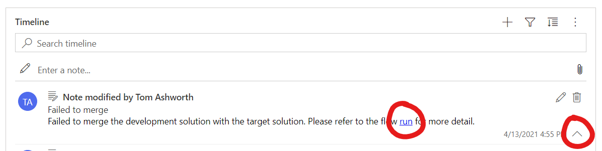

Once you believe the error to be resolved you can retry the solution merge using the retry button found in the ribbon of the solution merge.

Negative
: Note that once the solution has begun merge it block all other solution merges until it is complete, including while it is **Failed**. This is because once the development solution is imported in the master environment, the environment is considered "dirty" until the changes are merged into source control. If another solution were to be imported and extracted, it would include the changes of the previous incomplete merge. 

## Pull Request

The customisations have now been extracted into the Git repository and a Pull Request has been created ready for review. To view the PR, open the Azure Devops (ADO) project, expand the **Repos** section of the navigation on the left of the portal and select **Pull requests**. Select the **Active** tab and you will see the PR related to your changes. Click on the PR to open up the details.

The **Overview** tab contains the details of a PR such as required checks that must be completed before a PR can be completed, a list of required and optional reviewers and and comments that have been made. There is also a **Work items** section where you will see a link to the work item linked to the Dev Hub Issue.

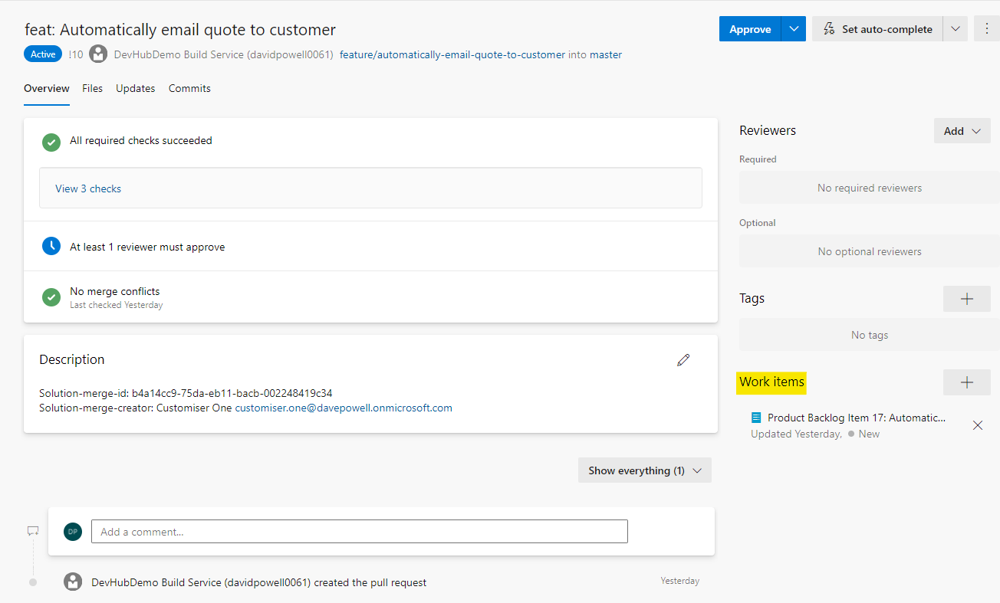

Select the **Files** tab to view all of the files that have been changed as part of this PR. This is where you can make comments against lines of code which the owner of the PR will be notified about.

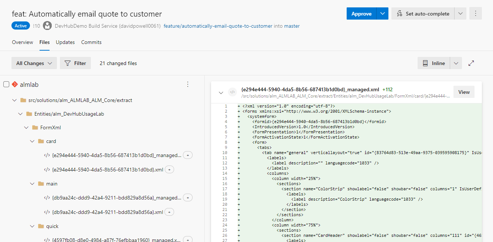

### Approving the PR

1. When you have checked the changes you approve the PR using the **Approve** button at the top right of the page.
   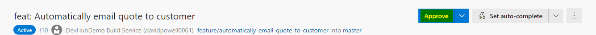

2. Once all of the required checks have been successful you will be able to complete the PR using the **Approve** button.
   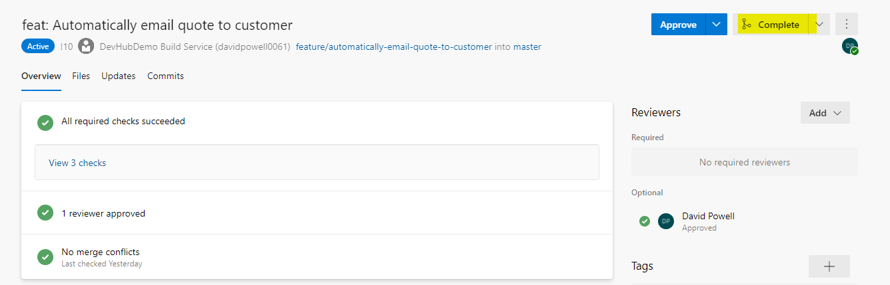

3. You will then see a **Complete pull request** dialog where you can select merge type and post completion options. You do not need to change any of the default settings. Selecting **Complete merge** will merge the PR branch into the Master branch and start the process of releasing the changes to the CI environment.

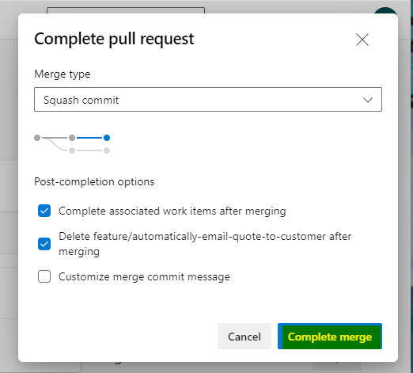
