id: alm-environment-setup
summary: Environment Setup.
categories: ALM
environment: Web
status: Draft
authors: Luke Phillips and Tom Ashworth

# Environment Setup

## Introduction

### What you'll build & learn

This lab gives you a hands-on walkthrough to setup several Power Platform environments for use with development hub. You will:

- use the power platform admin centre to create 3 environments (development, extract and continuous integration)
- use Azure Active Directory to create an application user
- register the new user across the 3 power platform environments with System Administrator rights

### Prerequisites

- Dynamics 365 admin, Global admin, or Power Platform admin to a PowerApps tenant
  - Dynamics 365 Admin or Power Platform Admin to create instances
  - Global Admin is only required if you want to configure Exchange integration and approve email accounts
- Azure DevOps organisation created with a project created
- Preferably you will **request your account have Project collection administrator access** in Azure DevOps but as most Azure DevOps instances are hosted by clients they are sometimes reluctant to grant you this permission. This permission is required to enable you to install the required third-party extensions to Azure DevOps that are consumed by our tooling. If you struggle getting these permissions **at a minimum you will need Project administrator access** for an Azure DevOps project so you can request the extensions to be installed by a Project collection administrator.

Project collection administrator access is required to install the following tools without approval, if not possible then Project administrator will allow you to request these tools be installed to an Azure DevOps organisation:

- [Power Platform Build Tools](https://marketplace.visualstudio.com/items?itemName=microsoft-IsvExpTools.PowerPlatform-BuildTools)
- [Sarif Viewer Build Tab](https://marketplace.visualstudio.com/items?itemName=sariftools.sarif-viewer-build-tab)

## Request additional tools for Azure DevOps

**Important:** Only required if you only have Project administrator access to Azure DevOps

Open [Power Platform Build Tools](https://marketplace.visualstudio.com/items?itemName=microsoft-IsvExpTools.PowerPlatform-BuildTools)

Select **Get it free**

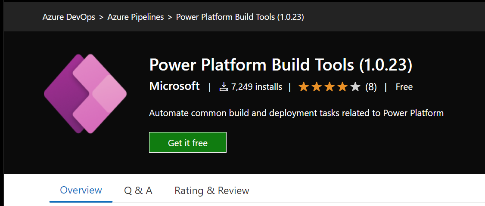

You'll then be prompted to **Select an Azure DevOps organization**. Select your Azure DevOps organisation and select **Request**

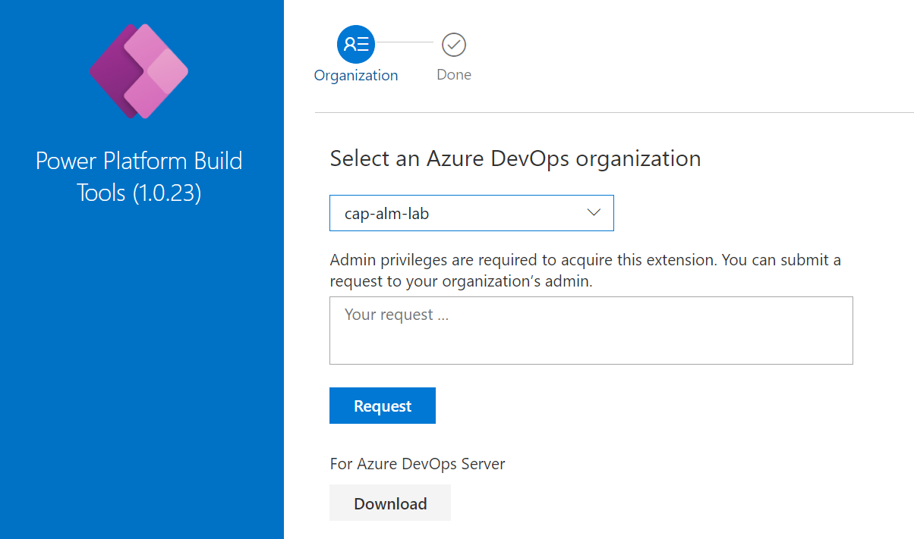

Repeat this step for [Sarif Viewer Build Tab](https://marketplace.visualstudio.com/items?itemName=sariftools.sarif-viewer-build-tab)

## Create environments

Open up the ['Power Platform admin center'](https://admin.powerplatform.microsoft.com/) as an admin (Dynamics 365 admin, Global admin, or Power Platform admin).

If not automatically re-directed, navigate to **Environments** in the left-hand pane

Click **New**

You will then be prompted to enter the following details:

<table>
    <tr>
        <th>
            Field
        </th>
        <th>
            Value
        </th>
    </tr>
    <tr>
        <td>
        </td>
        <td>
        </td>
    </tr>
    <tr>
        <td>
            Name
        </td>
        <td>
            {Project name}Development e.g. ALMDevelopment
        </td>
    </tr>
    <tr>
        <td>
            Type
        </td>
        <td>
            Sandbox
        </td>
    </tr>
    <tr>
        <td>
            Region
        </td>
        <td>
            United Kingdom - Default
        </td>
    </tr>
    <tr>
        <td>
            Purpose
        </td>
        <td>
            Include project name and reason for creating the environment e.g. ALM for MACE
        </td>
    </tr>
    <tr>
        <td>
            Create a database for this environment
        </td>
        <td>
            Yes
        </td>
    </tr>
</table>

Select **Next** to move onto next set of fields
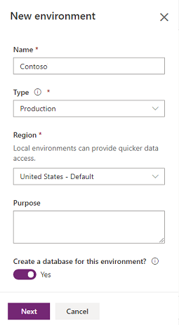

<table>
    <tr>
        <th>
            Field
        </th>
        <th>
            Value
        </th>
    </tr>
    <tr>
        <td>
            Language
        </td>
        <td>
            English
        </td>
    </tr>
    <tr>
        <td>
            URL
        </td>
        <td>
            [Project name][environment name] e.g. MACEALMDevelopment
        </td>
    </tr>
    <tr>
        <td>
            Currency
        </td>
        <td>
            GBP (£)
        </td>
    </tr>
    <tr>
        <td>
            Enable Dynamics 365 Apps
        </td>
        <td>
            Project dependent but for lab leave as **No**
        </td>
    </tr>
    <tr>
        <td>
            Deploy sample apps and data
        </td>
            No
        <td>
        </td>
    </tr>
    <tr>
        <td>
            Security group
        </td>
        <td>
            Not applicable
        </td>
    </tr>
</table>

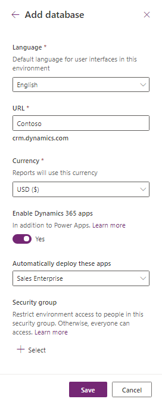

Select **Save**
Repeat steps above for the below two environments swapping out the details as necessary:

**Master**

<table>
    <tr>
        <th>
            Field
        </th>
        <th>
            Value
        </th>
    </tr>
    <tr>
        <td>
            Name
        </td>
        <td>
            [Project name]Master e.g. ALMMaster
        </td>
    </tr>
</table>

**CI**

<table>
    <tr>
        <th>
            Field
        </th>
        <th>
            Value
        </th>
    </tr>
    <tr>
        <td>
            Name
        </td>
        <td>
            [Project name]CI e.g. ALMCI
        </td>
    </tr>
</table>

**Important:** note down the **URLs of all environments** created into a text tool such as notepad as these will be used later on in the lab.

## Register a new Azure application

### Why?

The application in Azure Active Directory gives our development tooling, primarily Azure DevOps and Development Hub, the ability to talk to Dynamics 365. It enables:

- Development Hub to extract and import solutions across environments
- Allows to call Microsoft's Solution checker for the Power Platform in an Azure DevOps build to verify the quality of a solution

### Setup

Navigate to [Azure Active Directory](https://aad.portal.azure.com/)

From the left panel, choose **Azure Active Directory** > **App registrations**

Choose **+ New registration**

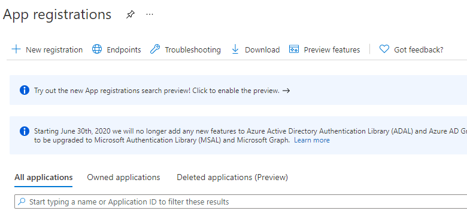

In the **Register an application form** provide a name for your app such as **DevOps User**, select **Accounts in this organizational directory only**, and choose **Register**. A redirect URI is not needed for this walkthrough and the provided sample code.

On the **Overview** page, select **API permissions**

Choose **+ Add a permission**

In the **Microsoft APIs** tab, **choose Dynamics CRM**

In the **Request API permission** form, select **Delegated permissions**, check **user_impersonation**, and select **Add permissions**

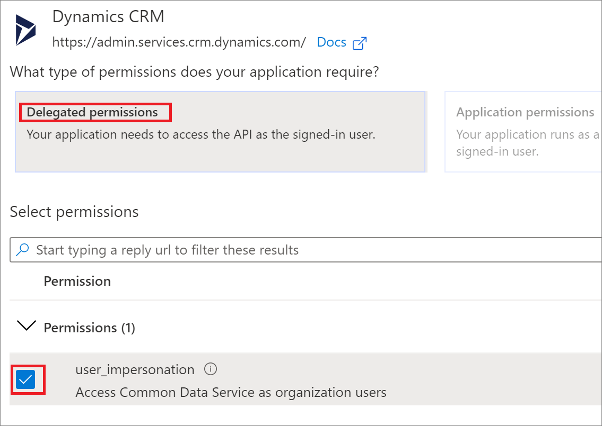

On the **API permissions** page select **Grant admin consent for "org-name"** and when prompted choose **Yes**

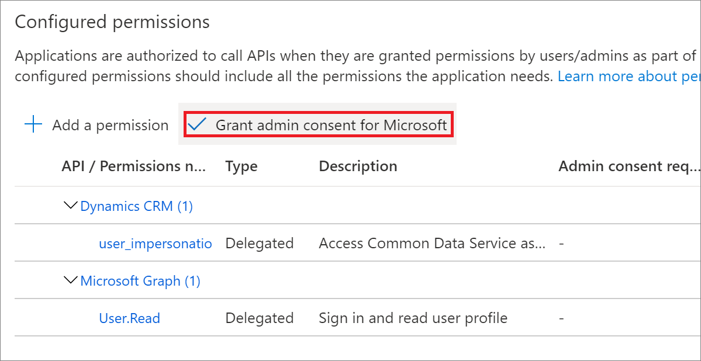

Important: Select **Overview** in the navigation panel, record the **Display name**, **Application (client) ID**, and **Directory (tenant) ID** values of the app registration. You will use these later in the lab.

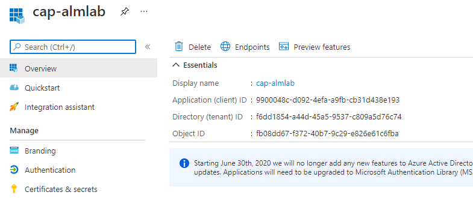

In the navigation panel, select **Certificates & secrets**

Below **Client secrets**, choose **+ New client secret** to create a secret

In the form, enter a description and select **Add**.

**Important:** Record the secret string. You will not be able to view the secret again once you leave the current screen.

## Application user creation

Open the **[Maker Portal](https://make.powerapps.com/)**.

Select the current environment (in the screenshot this is 'CSD - PP - Development') in the banner on the top right-hand side of the page and choose your Dataverse environment

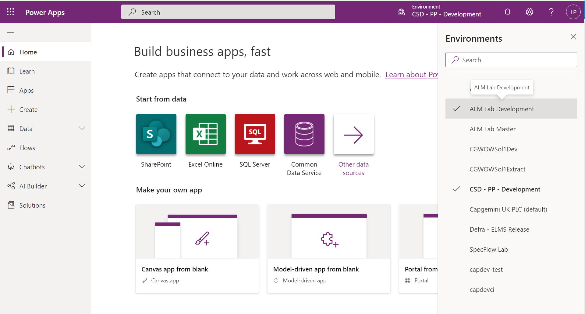

Once you're in the right environment, choose the **cog icon for Settings** and select **Advanced settings**

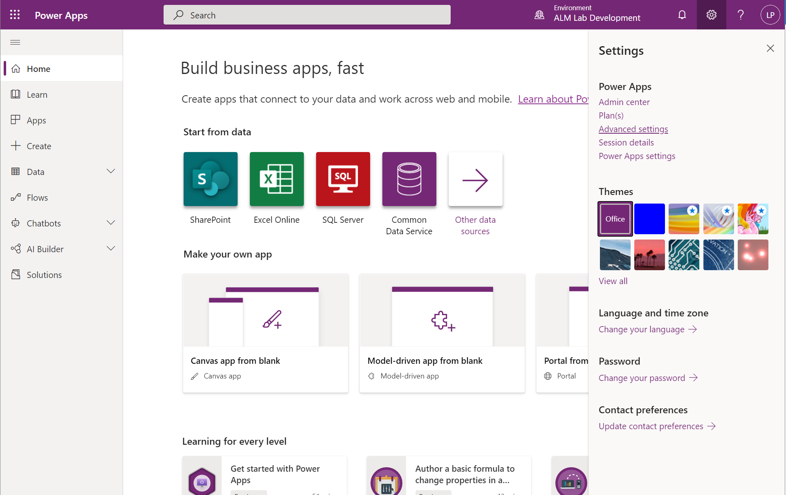

Navigate to **Settings** > **Security** > **Users**.

Change the view filter to **Application Users** by selecting **Enabled Users** and choosing **Application Users**

Select **+ New**.

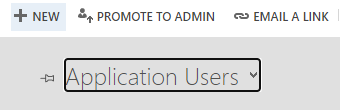

Change the Dynamics form by selecting **User** and choosing **Application User**
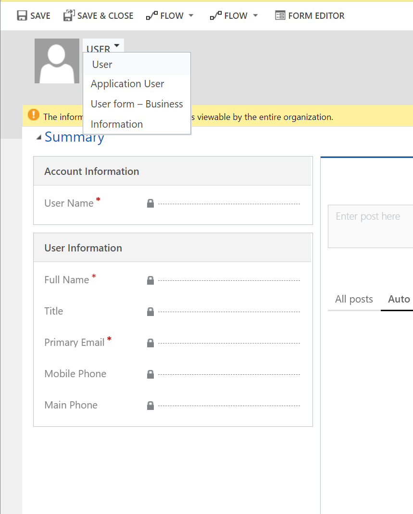

In the **Application ID** field, enter the **Application ID (Client ID)** of the app you registered earlier in Azure Active Directory which you also copied to a notepad and select **SAVE**
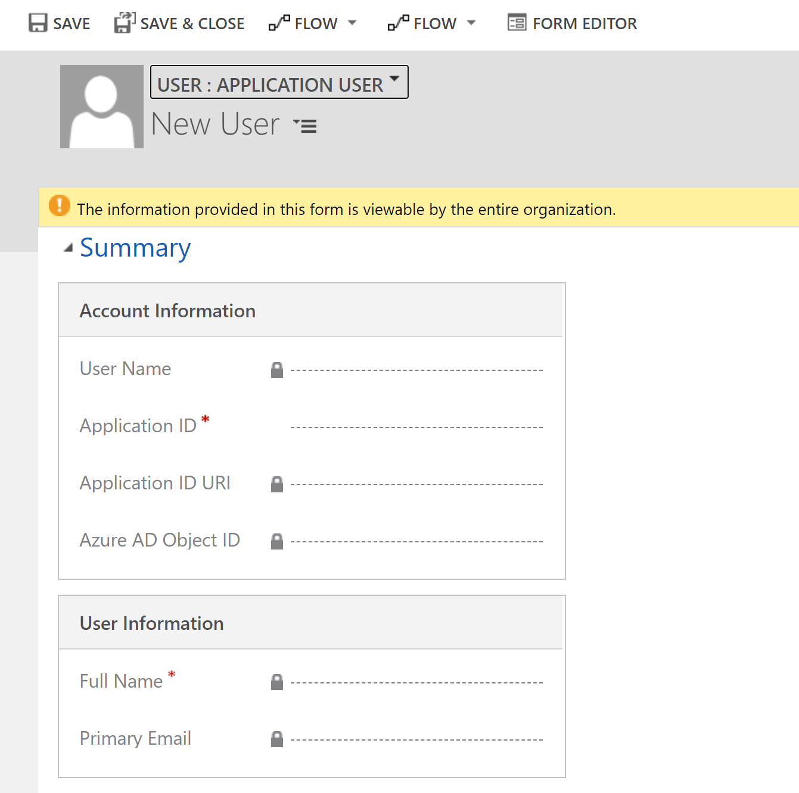

After selecting **SAVE**, if all goes well, the **User Name**, **Application ID URI**, **Azure AD Object Id**, **Full Name**, and **Primary Email** fields will auto-populate with correct values

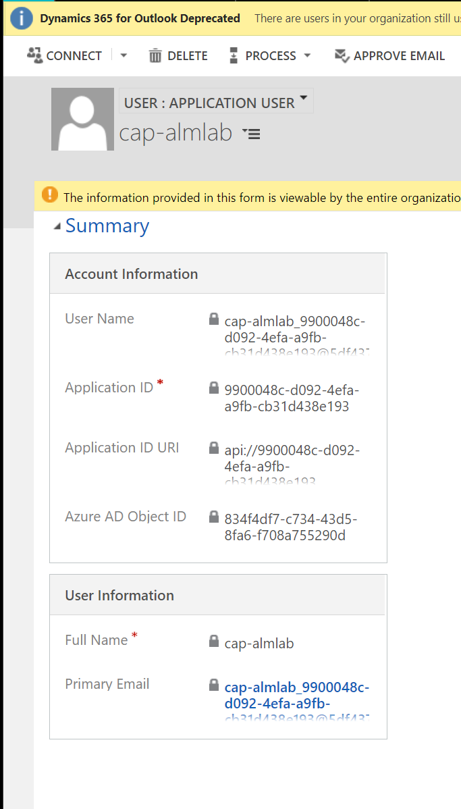

Before exiting the user form, choose **MANAGE ROLES** and assign the System Administrator security role.

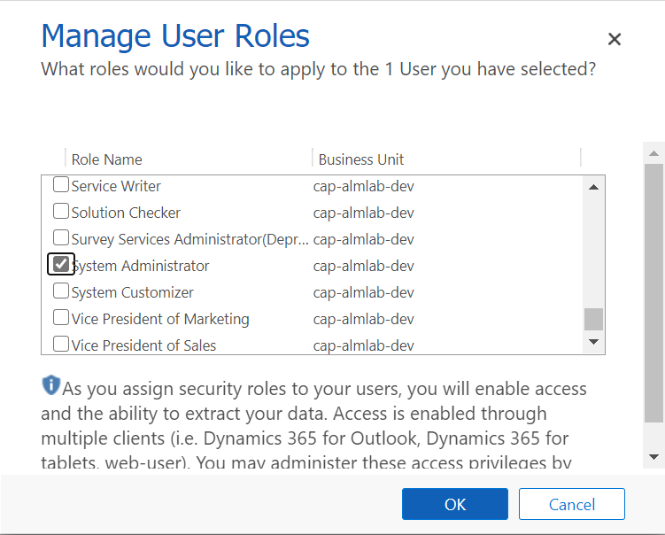

Click **OK**

Repeat this (Application user creation) step for the other two Power Platform environments you created earlier on:

- [Project name]Master
- [Project name]CI
