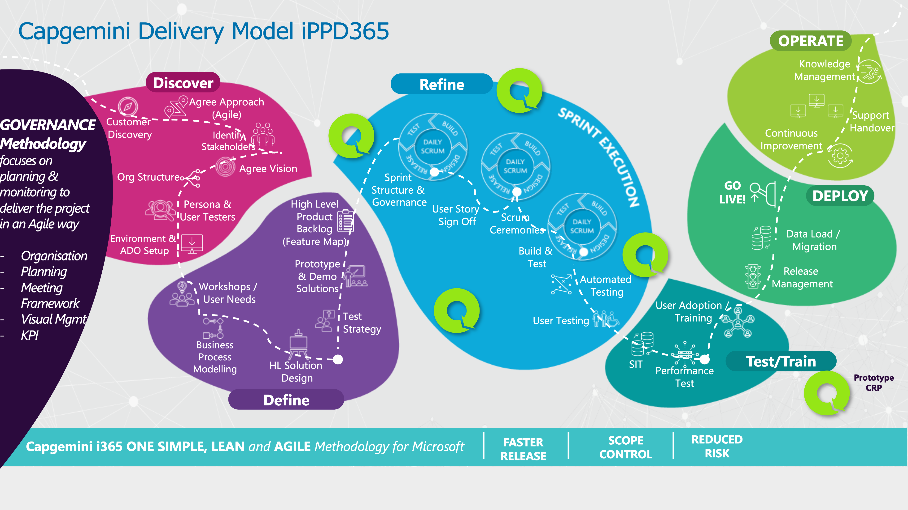

id: alm-introduction
summary: Introduction to ALM.
categories: ALM
environment: Web
status: Draft
authors: Luke Phillips and Tom Ashworth

# Introduction to ALM

## Why this is important

Modern software is increasingly complex and almost impossible to guarantee repeatable, predictable and consistent results using a manual approach for release and deployment of code across environments. This is only made more complicated by solutions being made up of a greater number of components than ever before.

Having well established processes and automated pipelines help us to increase quality of delivery achieving higher customer satisfaction.

The tools covered in this lab, PowerApps Project Generator and Development Hub will form the basis for all our projects which deliver solutions built on the Power Platform.

Our goal is for the whole team to be able to setup and configure these tools for projects and understand our approach to delivering software.

## Definition ALM

### What is ALM?

ALM (Application Lifecycle Management) tools provide a standardised system for communication and collaboration between software development teams and related departments, such as test and operations. These tools can also automate the process of software development and delivery. To that end, ALM combines the disciplines concerned with all aspects of the process to achieve the goal of driving efficiency through predictable and repeatable software delivery.

ALM includes these disciplines:

- requirements management
- software architecture
- development
- testing
- software maintenance
- change management
- continuous integration
- project management
- deployment
- and release management

This lab will **only cover the development, continuous integration, deployment and release management** aspects of ALM.

For further reading on ALM please visit [here](https://docs.microsoft.com/en-us/power-platform/alm/overview-alm)

---

### What is DevOps?

A compound of development (Dev) and operations (Ops), DevOps is the union of people, processes and technology to continually provide value to customers.

What does DevOps mean for teams? DevOps enables formerly siloed roles – development, IT operations, quality engineering and security – to coordinate and collaborate to produce better, more reliable products. By adopting a DevOps culture along with DevOps practices and tools, teams gain the ability to better respond to customer needs, increase confidence in the applications they build and achieve business goals faster.

We as a team are keen to have people skilled in both development and operations to provide to better understand the complete picture of solutions we implement.

For further reading on DevOps please visit [here](https://azure.microsoft.com/en-gb/overview/what-is-devops/)

## Tooling

)

### Azure DevOps

Azure DevOps (ADO) is a Software as a service (SaaS - meaning you pay a subscription fee for the provider to host, in this case Microsoft) platform from Microsoft that provides an end-to-end DevOps toolchain for developing and deploying software.

- Boards - A place to record and collaborate all of a projects work similar to Trello
- Repos - Advanced file management for project files and code, similar to Github
- Pipelines - Build solution artefacts, run automated tests and deploy across environments similar to Github actions
- Test Plans - Create test cases and record outputs of your manual / exploratory testing execution

### Project generator

An internal tool used to scaffold the necessary resources for a new project including:

- Generates a set of structured files that hold the base configuration for a new project which is uploaded (pushed) to a new repository in Azure DevOps
- Creates pipelines which builds, validates and deploys code to specified environments
- Can also generate additional files during the project lifecycle as the solution grows

For more info on the tool please visit the [Github project](https://github.com/Capgemini/powerapps-project-template)

#### Development Hub

A [model-driven Power App](https://docs.microsoft.com/en-us/powerapps/maker/model-driven-apps/model-driven-app-overview) that supports a teams development workflow within a shared development environment. It integrates with Azure DevOps to enable continuous integration by automatically creating pull requests or commits for an individual developer's changes.

For more info on the tool please visit the [Github project](https://github.com/ewingjm/development-hub#development-hub-)

#### Package deployer template

An extension of Microsoft's PowerApps package deployer which includes common functionality used across projects when deploying PowerApps solutions across environments

For more info on the tool please visit the [Github project](https://github.com/Capgemini/powerapps-packagedeployer-)
