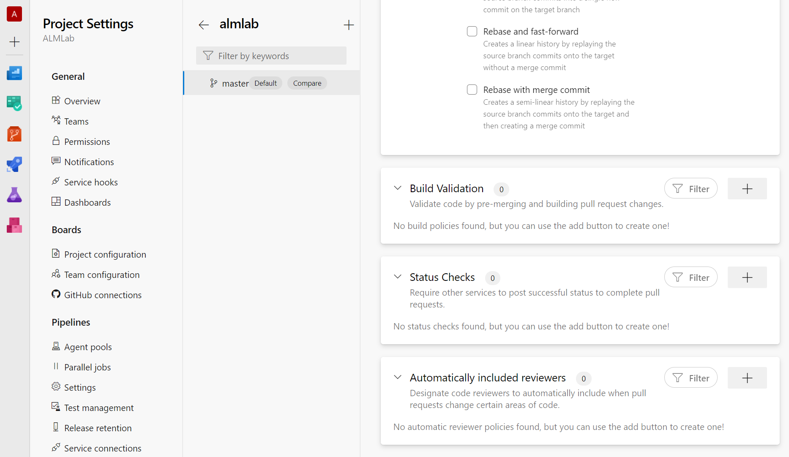

id: alm-new-project
summary: A lab to generate a project structure to be used as part of our development workflow.
categories: ALM
environment: Web
status: Draft
authors: Luke Phillips and Tom Ashworth

# Generate a new project

## Introduction

### What you will build

In this tutorial, you will generate a set of files files for a new project based on a standardised template that will:

- To create a source repository to store your development changes
- Create pipelines which builds, validates and deploys code to specified environments
- Can also generate additional files during the project lifecycle as the solution grows
- Create unmanaged solutions in <Project Name>Master environment
- Using the ADO generator to create the pipelines etc - inputs and outputs
- Setup branch policies and repo permissions

To achieve this, you'll use our tool, [Project Generator](https://github.com/Capgemini/powerapps-project-template).

### Prerequisites

- [NPM and Node JS](https://nodejs.org/)
- [VS Code](https://code.visualstudio.com)
- [Git](https://gitforwindows.org/)
- An Azure DevOps project
- A Power Apps Development Environment
- A Power Apps CI Environment
- A Power Apps Test Environment

Positive
: For setting up the Power Apps environments, follow [this](../alm-environment-setup) lab.

## Install the generator

Before you can generate a new project, you need to install the generator globally on to your local machine.

Firstly, open up a Command Prompt or PowerShell.

Next, install [yo](https://www.npmjs.com/package/yo), the generator engine, and [@capgeminiuk/generator-powerapps-project](https://www.npmjs.org/package/@capgeminiuk/generator-powerapps-project), our project generator.

```shell
npm install --global yo @capgeminiuk/generator-powerapps-project
```

## Generate base project

Stay in command prompt or PowerShell and navigate to the folder you want the generate the project within. For example:

```shell
cd C:/code
mkdir my-project
cd my-project
```

Next, run the base generator to build the file structure for our project by running.

```
yo @capgeminiuk/powerapps-project
```

It may take a few seconds for you to be prompted, but eventually you will be prompted for several inputs:

| Input                | Purpose                                                        | Example |
| -------------------- | -------------------------------------------------------------- | ------- |
| Name of the client?  | Used within naming files and folders produced by the generator | MACE    |
| Name of the package? | Used creating files, folders and PowerApps solutions           | ALMLAB  |

Open the generated project in either VS Code or the file explorer and take this opportunity to browse through the files seeing what was created and how the values you've entered have been passed into the naming of files and folders.

To open your project in VS Code from command prompt run `code .`


## Generate solution

Now we are going to generate our solution structure by running:

```shell
yo @capgeminiuk/powerapps-project:solution
```

You will again be prompted for several inputs:

| Input                                                     | Purpose                                                                                                                                                                                                                                                    | Example                                                                                 |
| --------------------------------------------------------- | ---------------------------------------------------------------------------------------------------------------------------------------------------------------------------------------------------------------------------------------------------------- | --------------------------------------------------------------------------------------- |
| Publisher prefix?                                         | Used to prefix components in PowerApps and is mapped to the solution prefix                                                                                                                                                                                | MACE                                                                                    |
| Name of the client?                                       | Used within naming files and folders produced by the generator, entered in the above **Generate solution** step. The command prompt will recognise your previously entered value and suggest the value which you can accept as a default by pressing enter | MACE                                                                                    |
| Name of the package?                                      | Used creating files, folders and PowerApps solutions, entered in the above **Generate solution** step. The command prompt will recognise your previously entered value and suggest the value which you can accept as a default by pressing enter           | ALMLAB                                                                                  |
| Name of the solution?                                     | Used to create the name of your solution in PowerApps                                                                                                                                                                                                      | Sample                                                                                  |
| Development environment URL?                              | Stored within the repository to be used for local extractions of solutions and config e.g. code generation. **Be sure to prefix URL with https://**                                                                                                        | _Paste the Development environment URL from notepad which we copied earlier in the lab_ |
| Are changes to this promoted using a staging environment? | Used to determine whether solution extracts should be done in Development or another extract.                                                                                                                                                              | Y if using Development Hub, overwise N                                                  |
| Staging environment URL?                                  | Only asked if you answered Y above. Used for extracting the solution locally or in the generated pipeline **Be sure to prefix URL with https://**                                                                                                          | _Paste the Master environment URL from notepad which we copied earlier in the lab_      |

You will then be prompted to overwrite the following files:

- `.vscode\tasks.json`
- `deploy\PkgFolder\ImportConfig.xml`

Enter `y` and press **Enter**

## Create unmanaged solution in Master environment

Open the [Maker portal](https://make.powerapps.com) and switch environments to the Master

Navigate to **Solutions** in the left-hand pane and select **+ New solution**

Enter the following details:

| Field        | Value                                                                                  | Example             |
| ------------ | -------------------------------------------------------------------------------------- | ------------------- |
| Display name | This should be the name of the package followed by the name of the solution.           | ALMLAB Sample       |
| Name         | This should be the name of the created solution folder                                 | MSACE_ALMLAB_Sample |
| Publisher    | Please create this yourself with the prefix given for the question 'Publisher prefix?' |                     |
| Version      | The initial solution version.                                                          | 1.0.0               |

Select **Create**

## Run automated Azure DevOps setup

First, you need to create a Personal Access Token (PAT) so that the generator can talk to Azure DevOps on behalf of your account.

Open Azure DevOps, select **User settings** (user icon with a little cog) and select **Personal access tokens**


Select **+ New Token** then enter the following values:


| Field            | Value                                                     |
| ---------------- | --------------------------------------------------------- |
| Name             | Generator                                                 |
| Organisation     | Ensure your current Azure DevOps organisation is selected |
| Expiration (UTC) | select an expiry date of tomorrow                         |
| Scopes           | Full access                                               |

<br>


Positive
: **Important:** Copy the token to notepad as you'll need this later.

Negative
: If Package Name and Azure DevOps Project name are the same then the generator will fail. In this case, rename the pre-created repo in Azure Devops by:

1. Go to the Project Settings
2. Under Repos, select Repositories
3. For the repo with the same name, use the three dots to rename the repo to '[existing name]\_old'

Now you are going to set up Azure DevOps by running `yo @capgeminiuk/powerapps-project:azuredevops`. You'll be prompted for the following inputs, after entering the value for each one, press **Enter**:

| Input                              | Purpose                                                                                                                                                                                                                                          | Example                                                                                           |
| ---------------------------------- | ------------------------------------------------------------------------------------------------------------------------------------------------------------------------------------------------------------------------------------------------ | ------------------------------------------------------------------------------------------------- |
| Azure DevOps URL?                  | The URL of the Azure DevOps Organisation                                                                                                                                                                                                         | https://dev.azure.com/cap-alm-lab                                                                 |
| Azure DevOps Auth Token (managed)? | Paste in the PAC generated before                                                                                                                                                                                                                | \*\*\*                                                                                            |
| Azure DevOps project?              | Select your project from the dropdown options by using the down arrows                                                                                                                                                                           | ALMLab                                                                                            |
| Name of the client?                | Used within naming files and folders produced by the generator                                                                                                                                                                                   | MACE                                                                                              |
| Name of the package?               | Used creating files, folders and PowerApps solutions, entered in the above **Generate solution** step. The command prompt will recognise your previously entered value and suggest the value which you can accept as a default by pressing enter | ALMLAB                                                                                            |
| CI Environment URL?                | The URL of the CI environment used for the solution checker and deploying to CI environment                                                                                                                                                      | https://[???].crm11.dynamics.com                                                                  |
| Service Account Email?             | The email address to use for the UI automation tests and running the extract pipeline. This user needs access to the 3 Power Platform Environments                                                                                               | If you don't have a service account, you can use your own for now and update these details later. |
| Service Account Password?          | Used in conjunction with the Service Account Username.                                                                                                                                                                                           |                                                                                                   |
| Tenant ID?                         | Used for creating the Service Connection in Azure DevOps which is used for the solution checker and deploying to CI environment                                                                                                                  | _Paste value from notepad which copied earlier in the lab_                                        |
| Application ID?                    | Used in conjunction with Tenant ID                                                                                                                                                                                                               | _Paste value from notepad which copied earlier in the lab_                                        |
| Client Secret?                     | Used in conjunction with Tenant ID                                                                                                                                                                                                               | _Paste value from notepad which copied earlier in the lab_                                        |

If the generation was successful, the output should look like this:

```
Setting up Azure DevOps...
Generating variable groups...
Creating Package - ALMLAB variable group...
Creating Integration Tests - ALMLAB variable group...
Creating Cake - ALMLAB variable group...
Generating repository...
Creating almlab repository...
Pushing initial commit to https://cap-alm-lab@dev.azure.com/cap-alm-lab/ALMLab/_git/almlab
Generating builds definitions...
Found 2 YAML builds.
Creating pipelines/azure-pipelines-dynamics-365-extract.yml build...
Creating pipelines/azure-pipelines.yml build...
Extension: PowerPlatform-BuildTools is already installed.
Extension: sarif-viewer-build-tab is already installed.
Generating service connections...
Generating release definition...
Creating ALMLAB release...
Finished setting up Azure DevOps.
Done.
```

## Set up Branch Policies

Within Azure DevOps navigate to **Project Settings** then under **Repos**, select **Repositories**.


Now select your repository called the package name you gave and select the **Policies** tab. Under **Branch Policy** select **master**.


Turn on:

- **Require a minimum number of reviewers**
  <br>
  Configure the settings as described below:

  | Field                                                            | Value                         |
  | ---------------------------------------------------------------- | ----------------------------- |
  | Minimum number of reviewers                                      | 2                             |
  | Allow requestors to approve their own changes                    | Unchecked                     |
  | Prohibit the most recent pusher from approving their own changes | Unchecked                     |
  | Allow completion even if some reviewers vote to wait or reject   | Unchecked                     |
  | When new changes are pushed:                                     | Reset all code reviewer votes |

- **Check for linked work items** ensuring **Required** is selected.

- Turn on **Check for comment resolutions** ensuring **Required** is selected.

- Turn on **Limit merge types** ensuring only **Squash merge** is checked.


Select the **+** (Add new build policy) button associated with **Build Validation**



Input the following values:

| Field                  | Value                                             |
| ---------------------- | ------------------------------------------------- |
| Build pipeline         | <Package name> - Package Build (PackageName)      |
| Path filter (optional) | N/A                                               |
| Trigger                | Automatic (whenever the source branch is updated) |
| Policy requirement     | Required                                          |
| Build expiration       | Immediately when master is updated                |
| Display name           | N/A                                               |

Select **Save**


