id: git-basics
summary: A lab to learn Git and Azure DevOps basics.
categories: Git
environment: Web
status: Draft
authors: Jie Zeng and Hamzah Rahim

# Git Basics

## Introduction

### What is version control?

A version control system (VCS) is a program or set of programs that tracks changes to a collection of files. One goal of a VCS is to easily recall earlier versions of individual files or of the entire project. Another goal is to allow several team members to work on a project, even on the same files, at the same time without affecting each other's work. 

With a VCS, you can: 

See all the changes made to your project, when the changes were made, and who made them. 

Include a message with each change to explain the reasoning behind it. 

Retrieve past versions of the entire project or of individual files. 

Create branches, where changes can be made experimentally. This feature allows several different sets of changes (for example, features or bug fixes) to be worked on at the same time, possibly by different people, without affecting the main branch. Later, you can merge the changes you want to keep back into the main branch. 

Attach a tag to a version—for example, to mark a new release. 

[(Source: What is version control? - Learn | Microsoft Docs) ](https://docs.microsoft.com/en-us/learn/modules/intro-to-git/1-what-is-vc)

### What is Git? 

Git is an open-source version control system and is the most widely used vcs in the tech industry.

There are a number of ways we can interact with Git:

-	Command Line
    - We can directly input commands into the command line within the relevant directory that contains our local repository (definition in next section)
-	Visual Studio GUI/Visual Studio code GUI
    - Both versions of visual studio can contain an Git GUI which makes executing Git commands, a lot easier. You will be interacting with this GUi in the exercises to come.
 

## Overview of how Git works

1.	Create a "repository" (project) with a git hosting tool (like gitHub)
2.	Copy (or clone) the repository to your local machine
3.	Add a file to your local repo and "commit" (save) the changes
4.	"Push" your changes to your main branch
5.	Make a change to your file with a git hosting tool and commit
6.	"Pull" the changes to your local machine
7.	Create a "branch" (version), make a change, commit the change
8.	Open a "pull request" (propose changes to the main branch)
9.	"Merge" your branch to the main branch
- [(source: Learn Git- Git tutorials, workflows and commands | Atlassian Git Tutorial)]()

Let’s look at some of the terms mentioned in this overview, in abit more detail:

### Fundamental Git Commands
- 	Repository
    - A folder insider a project which tracks all changes made to files, creating a history overtime.
- Branch
    - A branch is a way to add to a project without affecting the main part of a project. You create a branch which allows you to develop in isolation. You may then merge the changes in your branch, into the main part of the project. But as long as your changes are in the branch, they will not affect the main project.
- Git clone
    -	This command allows you get a copy of an existing remote repository and create a local version of it, on your computer
    - Every file and update from that branch(typically master, the main branch), is pulled into the folder you initiate git clone in
- Git status
    - This command gives us the status of the branch you are in. when you have made changes it will show how many you have made and to which files.
- Git Fetch
    - The git fetch command downloads commits, files, and refs from a remote repository into your local repo. Fetching is what you do when you want to see what everybody else has been working on.
    - [source: (Git Fetch | Atlassian Git Tutorial)]()
    - It allows you to see the history of the branch without affecting your local work on the branch
- Git Commit
    - This command ‘saves’ a snapshot of your projects state, into the commit history
- Git Pull
    - The git pull command is used to fetch and download content from a remote repository and immediately update the local repository to match that content.
    - [source: ( Git Pull | Atlassian Git Tutorial)]()
- Git Push
    - The git push command is used to upload local repository content to a remote repository. Pushing is how you transfer commits from your local repository to a remote repo.
    - [source: ( Git Push | Atlassian Git Tutorial)]()
- Git Checkout
    - Git checkout is used to switch to a specific branch
    - For example, you may create a new branch and switch from master to the newly created branch

## Azure Repos Git

### Git workflow

Version control has a general workflow that most developers use when writing code and sharing it with the team. Git has a version of this workflow using terminology and commands unique to Git. 

These steps are:

- Clone/Create a repository
  - **Clone an existing repository** from the project in DevOps.
  - If required, you can **Create a new repository** for the project in DevOps.
- Get a local copy of code if they don't have one yet.
  - **Create a branch** for the changes you plan to make and give it a name, such as users/jamal/fix-bug-3214 or cool-feature-x.
- Make changes to code to fix bugs or add new features.
  - **Commit changes** to your branch. People often have multiple commits for a bug fix or feature.
  - **Push your branch** to the remote repository.
- Once the code is ready, make it available for review by your team.
  - **Create a pull request** so other people can review your changes. To incorporate feedback, you might need to make more commits and push more changes.
- Once the code is reviewed, merge it into the team's shared codebase.
  - **Complete your pull request** and resolve any merge conflicts from changes other people made after you created your branch.

Throughout the rest of this lab tutorial you'll learn about how to use the above commands.

## Clone an existing repository

### Visual Studio 2019

- Sign in Visual Studio with your account.

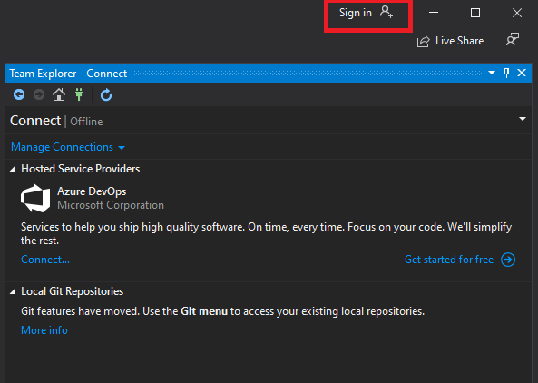

- In Team Explorer, open the Connect page by selecting the Connect button. Choose Manage Connections then Connect to Project.

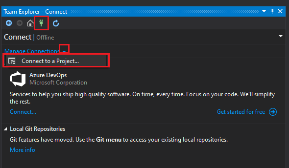

- In Connect to a Project, select the repo you want to clone from the list and select Clone. **Note:** I recommend creating a new folder "workspaces" on C drive to keep your code instead of the default path.
 
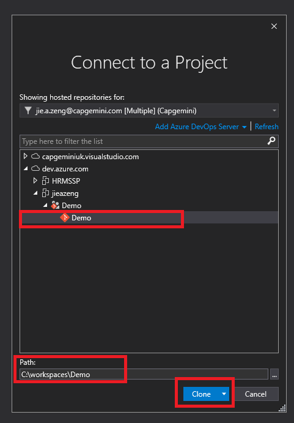

## Create a new repository

### Create a repo using the web portal

Navigate to the Repos page in your project.

From the repo drop-down, select New repository.

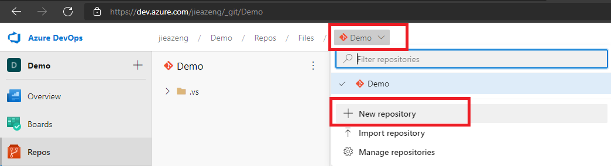

In the Create a new repository dialog, verify that Git is the repo type and enter a name for your new repo. You can also add a README and create a .gitignore for the type of code you plan to manage in the repo. A README contains information about the code in your repo. The .gitignore file tells Git which types of files to ignore, such as temporary build files from your development environment.

Set options for your new repo in the Create a Git repo dialog. When you're happy with the repo name and choices, select Create.

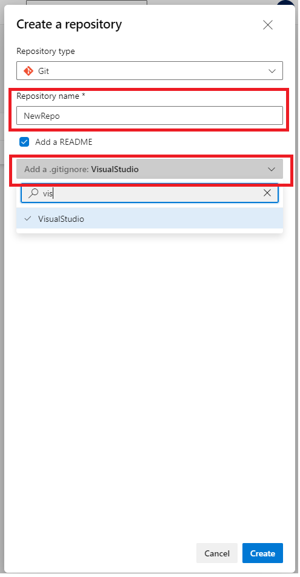

You will now have a new repository in your project. 

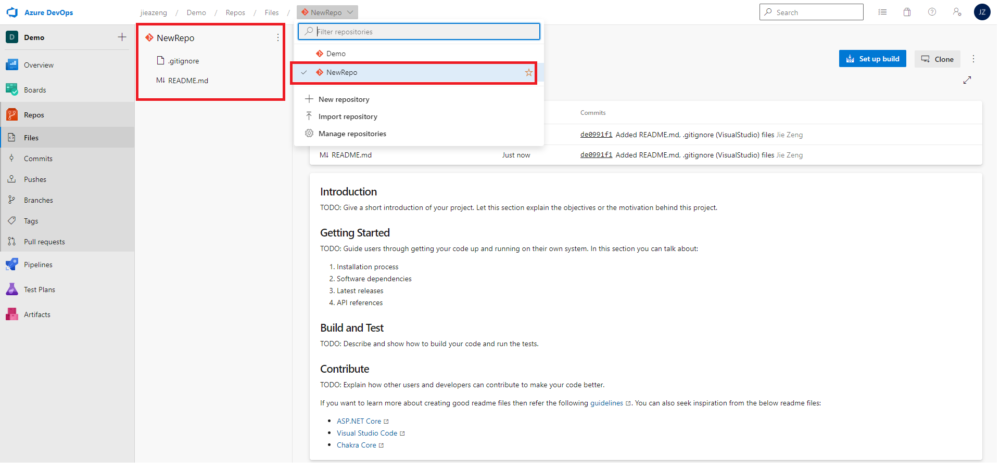

You can follow the previous step to clone this new repository to your local and start using it.

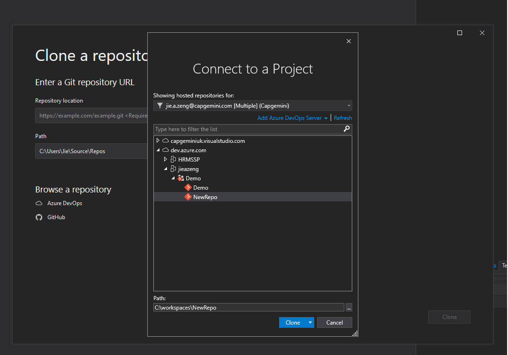

## Create a branch

On the menu, click **Git** and go to **Manage Branches**

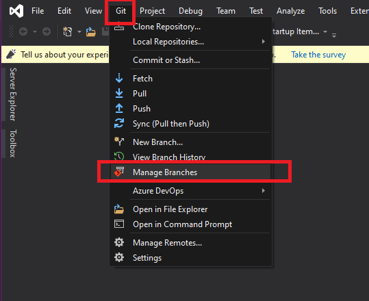

Choose the parent branch (usually main or master) to base your changes, right click and choose New Local Branch From....

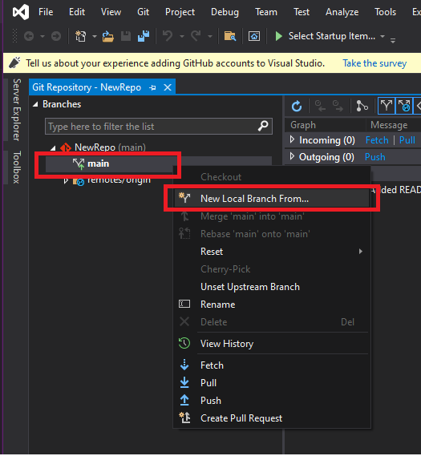

Supply a branch name in the required field and select Create Branch.

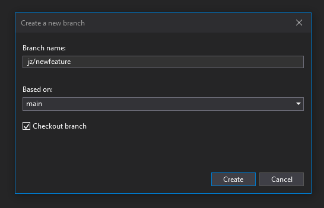

Visual Studio automatically performs a checkout to the newly created branch.

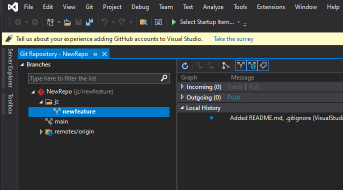

## Commit changes

Git does not automatically add changed files to the snapshot when you create a commit. You must first stage your changes to let Git know which updates you want to add to the next commit. Staging lets you to selectively add files to a commit while excluding changes made in other files.

### Stage changes

Stage individual file changes by right-clicking a file in the Change view and selecting Stage. Staging a change creates a Staged Changes section in Team Explorer. Only changes in the Staged Changes section are added to the next commit.

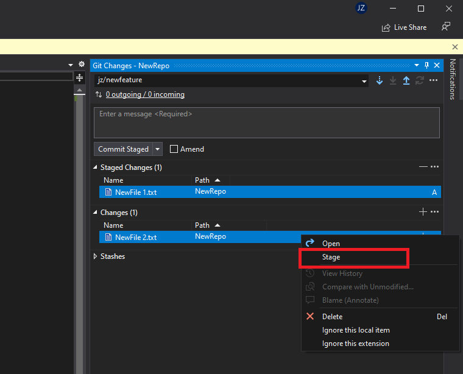

Stage multiple files or folders by selecting them then right-clicking and choosing Stage or by dragging and dropping files from the Changes list into the Staged Changes list.

Ignore files by right-clicking and selecting Ignore this local item or Ignore this extension. This adds an entry to the .gitignore file in your local repo. If the ignored file was added to your repo in an earlier commit, ignoring the file will not remove it from the Changes list. See excluding and ignoring files section for more information on how to ignore files already tracked by Git.

### Create a commit

Open the Git Changes view in Team Explorer.

Enter a commit message describing your changes and select Commit Staged to create a new commit that includes the changes listed in the Staged Changes section.

Skip staging files if you just want to commit all changes listed by entering a commit message and selecting Commit All when you have no staged changes.

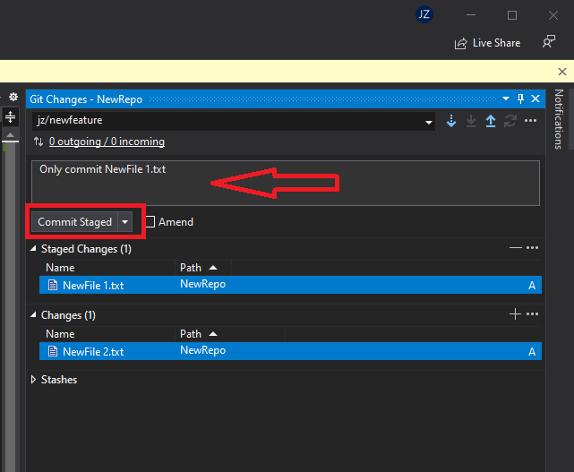

## Push your branch

When you commit in Visual Studio you can **push** the commit to a remote repository.

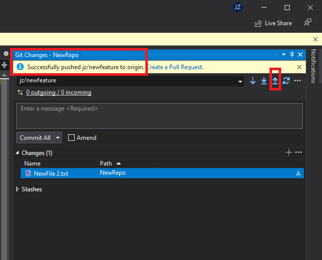

For the subsequent changes that you would like to commit, you can sync the branch with a remote repository. You can do this with the  button. Git makes sure that pushed changes are consistent with the remote branch. Others can pull your commits and merge them into their own local copy of the branch. 

## Create a pull request

### Create a new PR from the Azure DevOps project website

You can create PRs for any branch from your project's Pull requests page on the web.

- On the **Repos** > **Pull requests** page, select New pull request at upper right. After you push or update a feature branch, Azure Repos displays a prompt to create a PR.

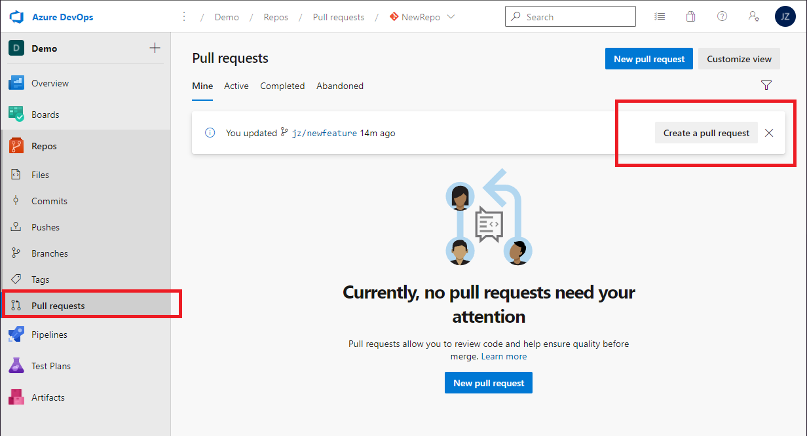

Select the branch with the changes and the branch you want to merge the changes into, such as the main branch. Enter your PR details and create the PR.

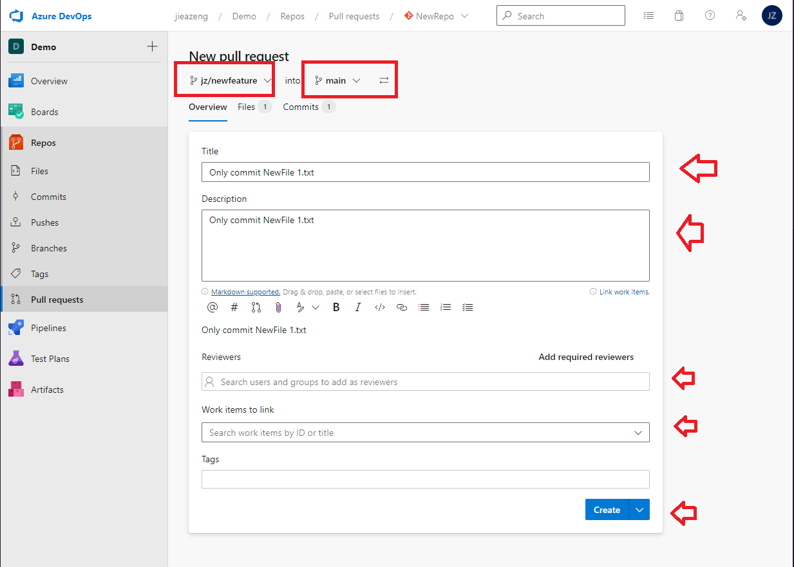

## Complete your pull request

You can access PRs for any branch from your project's Pull requests page on the web.

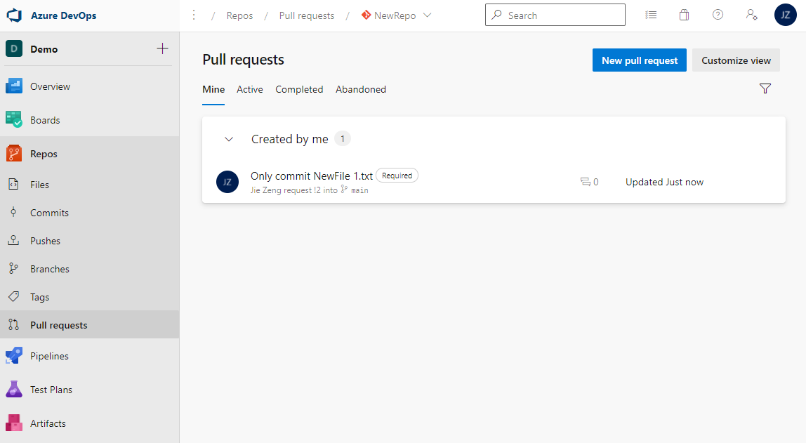

Once all required reviewers approve your pull request (PR) and the PR meets all branch policy requirements, you can merge your changes into the target branch and complete the PR. Or if you decide not to proceed with the changes in the PR, you can abandon the PR.

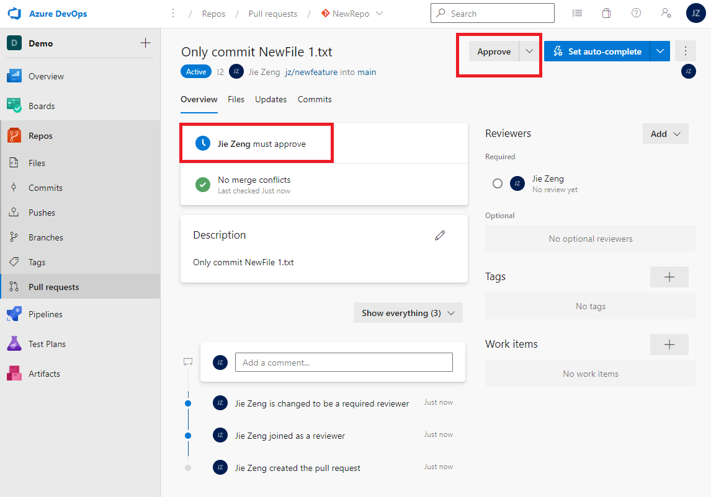

To merge your changes into the target branch, click Complete

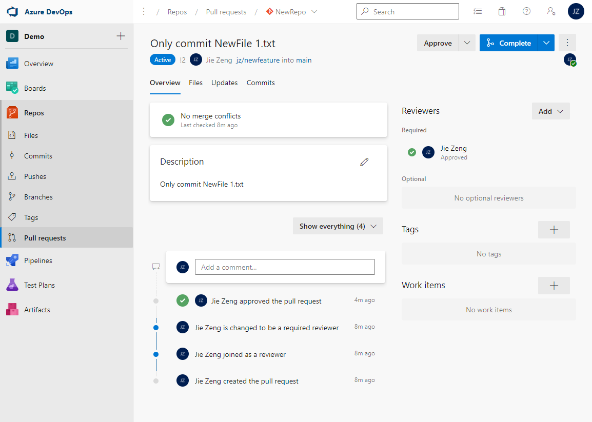

Choose **Squash commit** as the Merge Type and click **Complete merge**

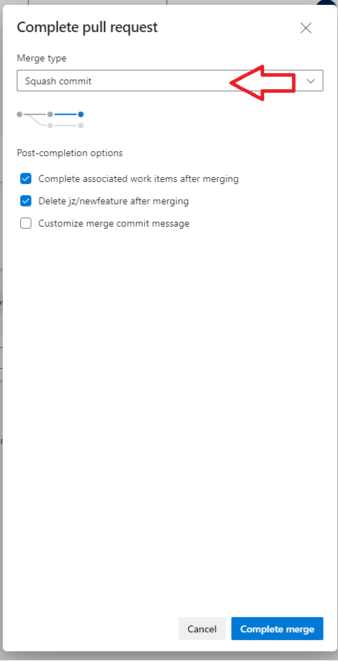

Your changes have now been merged into the target branch

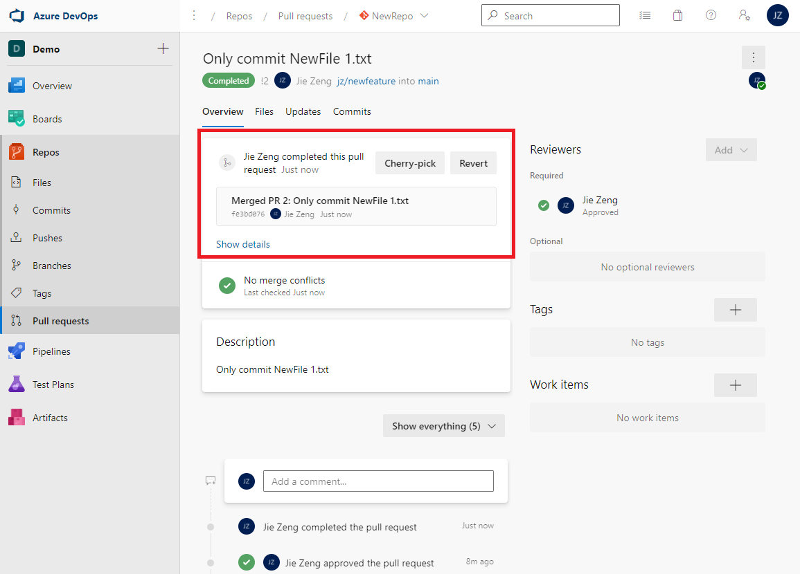