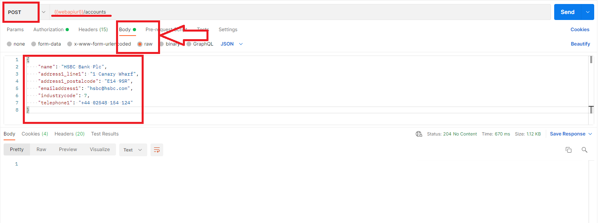
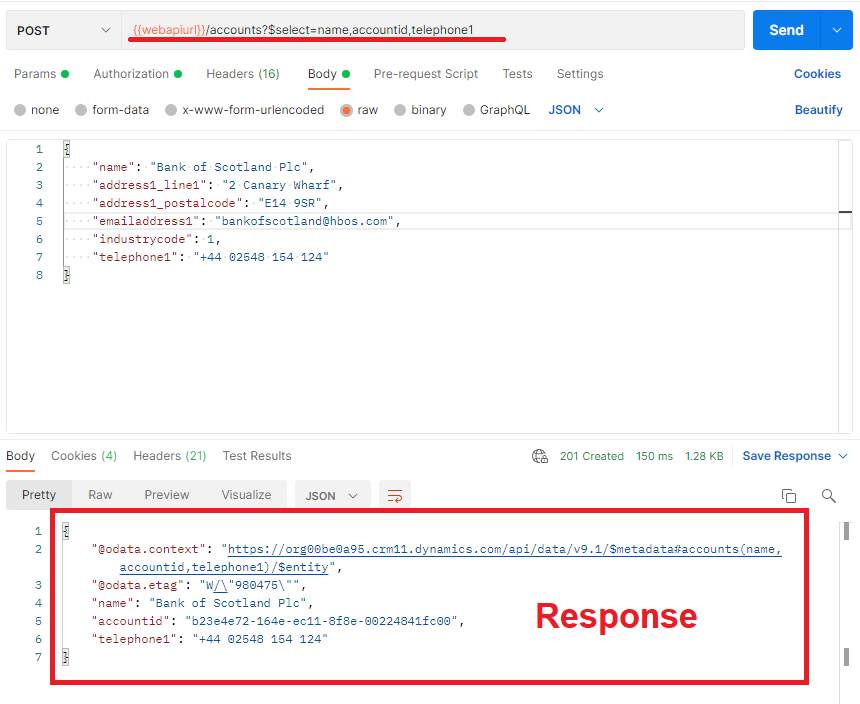

id: postman-with-power-platform
summary: A lab to learn the learn how to use Postman with Power Platform Web API.
categories: Web API Tools,
environment: Web
status: Draft
authors: Ahmet Oztourk

# Using Postman with Power Platform

## Introduction

The aim of this lab is that you will learn how to configure Postman and build basic CRUD (Create, Read, Update and Delete) requests to be used with Power Platform Web API. Postman is one of the most popular third-party tools that can be used to authenticate to Microsoft Dataverse instances and to create and send Web API requests and view responses.

### Prerequisites
- Power Apps Dataverse instance that you can connect to. You can find more information around creating environments in - [Environment Setup Codelab](https://capgemini.github.io/microsoft-team-labs/codelabs/alm-environment-setup/index.html?index=..%2F..%2Fmicrosoft-team-labs%2F#2)
- Azure Application User - You can find more information in how to register an application user in [Environment Setup Codelab](https://capgemini.github.io/microsoft-team-labs/codelabs/alm-environment-setup/index.html?index=..%2F..%2Fmicrosoft-team-labs%2F#4)
- [Download and install the Postman desktop application (Windows 64-bit)](https://www.postman.com/downloads/)

Some links you might find useful through out this lab:

- [Learning Postman](https://learning.postman.com/docs/getting-started/introduction/)
- [Power Platform Web API](https://docs.microsoft.com/en-us/powerapps/developer/data-platform/webapi/perform-operations-web-api)

## What is Postman?

Postman is an API client that makes it easy for developers to create, test and share API requests. It allows users to create and save HTTP/s requests and it allows users to read their responses as well. Postman allows you to either create an account for free or continue to use the app without an account.

There are few features to point out about Postman before we continue with the rest of this lab. 

### API Client

Postman API Client is the main tool which enabled users to easily to define API requests. It automatically detects the language of response and format the text inside the body to make any inspection easy. The client also includes built-in support for authentication protocals like OAuth 1.2/2.0 and many more. 
API Client allows you to organize requests into collections to help organize the requests for reuse so you dont have to waste time building everything from scratch. 

### Environment and Variables in Postman

An environment in Postman is a set of key-value pair variables called 'Environment Variables' that you can reference and use in your requests. When you create an environment inside Postman, any chan**ge to value of the key-value pairs will reflect in the requests so that we do not need to update the requests.
Multiple environments can be created in Postman and each environment can have their own set of variables created. Variables created inside of an environment are 'Local Scope Variables' and they will only work inside the environment they were created in. However Global variables can be created in Postman as well and they do not belong to any specific environment. 

### Workspaces  

Postman Workspaces help you organize your API work and share with others. You will need to create a Postman Account to be able to use workspaces. In this lab we will be using Personal Workspace and they are degisned for individual work. They contain all the tools required to work with APIs and you can access them between different Postman instances.

### Postman Navigation

### 1 - Side Bar Section
This box is where you can find environments, history, collections and apis.

### 2 - Request Builder Section
This box is where you can build requests and select which environment to use.

### 3 - Response Section
This box shows the response from the server that you receive after executing a particular request.

Information on more complex tools in Postman, such as **Collection Runner** can be found in the Learning Postman link above. Collection Runner allows you to save multiple requests in a specific order and execute them.

## Setup Postman Environment
Once you downloaded and installed postman, you will now need to sign up to a free postman account in order for you to be able to create a workspace and environment for this lab.

Launch Postman once it is installed and you will get the screen below to create a free account

Go ahead and click Create Free Account and simply follow the steps by providing an email address and a password

When asked to **Create your own team**, please click on **Continue Without a Team** button as shown below

You should now on the screen below

To access your **'Private Workspace'** please click on **Workspaces** on the toolbar and select **My Workspace** from the dropdown

Once you selected **'My Workspace'** , you should now see the screen below where you can start to create an environment and adding variables

### Create A Postman Environment

Click on **Environments** from the left Side Bar Section and then click on **+ Create New Environment** as shown below

And give your environment a meaningful name. Once environment has been created, you will see your environment as shown below and now you are ready to add in local variables to your environment

## How to connect Postman to Power Platform

There is a set of variables required by Postman in order to authenticate to Power Platform using OAuth2.0. These variables are;

<table>
  <tr>
   <td><strong>Variable Name</strong>
   </td>
   <td><strong>Value</strong>
   </td>
  </tr>
  <tr>
   <td>url
   </td>
   <td>Power App instance url https://<add your instance url>.crm11.dynamics.com
   </td>
  </tr>
  <tr>
   <td>clientid
   </td>
   <td>Application Registration Client Id created in pre-requisites
   </td>
  </tr>
  <tr>
   <td>version
   </td>
   <td>9.1
   </td>
  </tr>
  <tr>
   <td>webapiurl
   </td>
   <td>{{url}}/api/data/v{{version}}/
   </td>
  </tr>
  <tr>
   <td>callback
   </td>
   <td>https://callbackurl
   </td>
  </tr>
  <tr>
   <td>authurl
   </td>
   <td>https://login.microsoftonline.com/common/oauth2/authorize?resource={{url}}
   </td>
  </tr>
  <tr>
   <td>clientsecret
   </td>
   <td>Application Registration Client Secret value created in pre-requisites
   </td>
  </tr>
  <tr>
   <td>tenantid
   </td>
   <td>Application Registration tenant id in Azure Active Directory
   </td>
  </tr>
  <tr>
   <td>authtokenurl
   </td>
   <td>https://login.microsoftonline.com/{{tenantid}}/oauth2/v2.0/token
   </td>
  </tr>
</table>

Once you created these in your environment then click on **Save** it should look as shown below

### Generate an access token to use with Environment

There are multiple ways to getting a token in order to connect to Power App instance. First you will need to create a new tab in order to build a request. To do this please follow below:

- Select File > New and from **Create New** dialog box, select **HTTP Request**. This will add a new tab into Request Builder Section . Please make sure you set the environment to the one created in the **Create Environment Step** as shown below.

To create a token using **Client Credentials** as **Grant Type**:
- Select **Authorization** and set Type to **OAuth 2.0** and set the **Grant Type** to Client **Credentials** and then fill in the rest of the fields under **Configure New Token** section with the variables created in **Create Environment Step**. Once all set it should look like below.

- Then to generate the token, click **Generate New Access Token** button and you will then be presented with **Get New Access Token** dialog window. Once this shows **Authentication Complete** then click **Proceeed** as shown below.

- Then you will be presented with the **Manage Access Token** dialog. Give the token any name and click on **Use Token**

**IMPORTANT NOTE** Access Tokens DO expire. When expired you will receive 401 response. You can simply in the same tab click **Generate Access Token** button again and grab a new token. You can then continue sending your requests.

- You are now ready to execute your first request against the Power Platform instance using **WhoAmI** request to confirm connection is working. To do this please follow below:
    **GET** request will be used and request url will be set to **{{webapiurl}}/WhoAmI** as shown below. When you are ready to execute the request then click **Send** button.
    
    

    Response code 200 is a success. And we can see the response for the request sent

## Retrieve Records from Power Platform using Postman

This chapter will cover different ways of retrieving records from Power App instance using Postman. GET request is used for retrieving records.

[Microsoft Dataverse WebAPI](https://docs.microsoft.com/en-us/powerapps/developer/data-platform/webapi/retrieve-entity-using-web-api) documentation is a really good reference source when building requests.

### 1- Retrieve all fields for specific entity type

Notation used for retrieving all records for an entity type is "organizationurl.crm11.dynamics.com/api/data/v9.1/contacts".

Below is a GET request example to retrieve all contacts and all their properties in a Power App instance

request:

response:

**value** property of the response is an array where all the returned results are and properties for each contact can be seen there.

### 2- Retrieve all fields for a specific record

Notation used for retrieving all fields for a specific record is "organizationurl.crm11.dynamics.com/api/data/v9.1/contacts(recordid)". 

Below is a GET request example to retrieve all fields for a contact with id (26b4e52d-034e-ec11-8f8e-00224841fc00)

request:

response:

When executing a request to retrieve only one specific record, the response does not contain a value property.

### 3- Retrieve only selected fields for a record

Notation used for retrieving only selected few fields for a record is "organizationurl.crm11.dynamics.com/api/data/v9.1/contacts(recordid)?$select=field1name,field2name,field3name". Schema names of fields has to be used in webapi requests.

Below is a GET request example to retrieve selected fields for a contact with id (26b4e52d-034e-ec11-8f8e-00224841fc00)

request:

response:

As it can be seen from the response above, only requested fields have been returned.

### 4- Retrieve data about lookup fields

**$expand** query option is used to control what data from related entities is returned.

Notation for this request is "organizationurl.crm11.dynamics.com/api/data/v9.1/contacts(recordid)?$select=field1name,field2name,field3name&$expand=lookfield($select=lookup.field1,lookup.field2)". Schema names of fields has to be used in webapi requests.

Please keep in mind, if you choose to expand on lookup fields like 'Customer - schema name is parentcustomerid' field which can be referencing more than one type of table then while writing webapi queries you will need to use parentcustomerid_account or parentcustomerid_contact to define which entity type you are expanding.

Below is a GET request example for **expand** query

request and response:

### 5- Retrieve related entities for an entity by expanding collection-valued navigation

This is achieved by using the **$expand** query again. The collection-valued navigation property is for a 1:N relationship on the entity. This can be found in the Power App Maker Portal.

Below is a GET request example for this

request and response:

As it can be seen from response both the contacts related to the record has been retrived.

### 6- Retrieve records by running a filter criteria

[Query Data with Web API - Filter Results](https://docs.microsoft.com/en-us/powerapps/developer/data-platform/webapi/query-data-web-api#filter-results) documentation is a really good reference source when building these requests.

**$filter** query option is used to apply a criteria when running a retrieve request.

Notation for this request is "organizationurl.crm11.dynamics.com/api/data/v9.1/contacts(recordid)?$select=field1name,field2name,field3name&$filter=field eq criteria"

Below is a GET request example with filter query

request and response:

**IMPORTANT TIP** all the retrieve queries above can be executed in a browser too. To do this please follow below:

- Open a browser session and log into to a Power App instance
- Open a new browser tab and simply put any of the queries above into the url and hit enter as shown below. i.e. https://organizationname.crm11.dynamics.com/api/data/v9.1/contacts(recordid)

## Create Records in Power Platform using Postman

This chapter will cover creation of records in Power Platform instance using Postman. POST request is used for creating records.

[Microsoft Dataverse WebAPI](https://docs.microsoft.com/en-us/powerapps/developer/data-platform/webapi/create-entity-web-api) documentation is a really good reference source when building requests.

To create records using Postman please do below before trying to create any record.
- In Request Builder Section, the query type will need to changed to **POST**
- In Request Builder Section, enter **{{webapiurl}}/entitypluralname** into query url section
- Add below key value pairs as shown in the Query Headers

<table>
  <tr>
   <td><strong>Key</strong>
   </td>
   <td><strong>Value</strong>
   </td>
  </tr>
  <tr>
   <td>If-None-Match
   </td>
   <td>null
   </td>
  </tr>
  <tr>
   <td>OData-Version
   </td>
   <td>4.0
   </td>
  </tr>
  <tr>
   <td>Content-Type
   </td>
   <td>application/json
   </td>
  </tr>
  <tr>
   <td>Accept
   </td>
   <td>application/json
   </td>
  </tr>
  <tr>
   <td>OData-MaxVersion
   </td>
   <td>4.0
   </td>
  </tr>
</table>

 

**IMPORTANT NOTE** Properties that you want to set when creating the record needs to be added to the request **Body** section as a JSON value. Schema names of fields has to be used in request body.

### 1- Basic Create

Below is an example to create an account.

As it can be seen from the response, the 204 success is returned which means request has been executed succesfully.

### 2- Create records with data returned

Data about the created record can be returned in the same request. To be able to do this please add below to the Headers key value pair.

- key = Prefer
- value = return=representation

and **$select** query needs to be amended to the end of the url. "organizationurl.crm11.dynamics.com/api/data/v9.1/accounts?$select=field1name,field2name,field3name"

Below is an example to create an account with data returned.

As it can be seen from the response, the 201 success is returned which means request has been executed succesfully and data returned.

### 3- Create related records - Deep Insert

Related records can be created by defining them as navigation properties and this is known as **deep insert**.

**Create a related record using single-valued navigation property**

Below example is a request to create a contact and defining the code_laptopid(lookup) field navigation property as well. Because we defined the code_laptopid property without id, a laptop record should be created as well.

As it can be seen from the response, the 201 success is returned which means both contact and the laptop record have been created.

**Create related records using collection-valued navigation property**

Below example is a request to create a laptop record and multiple contact records related to it by defining the collection-valued navigation property. Collection-valued navigation property is the schema name of the 1:N relationship between laptop and contact tables. This can be found in the Power App Maker Portal.
Collection-valued navigation property is set as a json array as it can be seen in the example below.

As it can be seen from the response, the 201 success is returned which means laptop record and both contact records have been created.

## Update Records in Power Platform using Postman

This chapter will cover update of records in Power Platform instance using Postman. PATCH request is used for updating records.

[Microsoft Dataverse WebAPI](https://docs.microsoft.com/en-us/powerapps/developer/data-platform/webapi/update-delete-entities-using-web-api) documentation is a really good reference source when building requests.

To update records using Postman please do below before trying to update any record.
- In Request Builder Section, the query type will need to changed to **PATCH**
- In Request Builder Section, enter **{{webapiurl}}/entitypluralname(recordid)** into query url section
- Add below key value pairs as shown in the Query Headers

<table>
  <tr>
   <td><strong>Key</strong>
   </td>
   <td><strong>Value</strong>
   </td>
  </tr>
  <tr>
   <td>If-None-Match
   </td>
   <td>null
   </td>
  </tr>
  <tr>
   <td>OData-Version
   </td>
   <td>4.0
   </td>
  </tr>
  <tr>
   <td>Content-Type
   </td>
   <td>application/json
   </td>
  </tr>
  <tr>
   <td>Accept
   </td>
   <td>application/json
   </td>
  </tr>
  <tr>
   <td>OData-MaxVersion
   </td>
   <td>4.0
   </td>
  </tr>
</table>

**IMPORTANT NOTE** Properties that you want to update needs to be added to the request body section as a JSON value. This will be shown in the following examples.

### 1- Basic Update

Below is an example to update an existing record.

As it can be seen from the response, the 204 success is returned which means request has been executed succesfully.

### 2- Update records with data returned

Data about the updated record can be returned in the same request. To be able to do this please add below to the Headers key value pair.

- key = Prefer
- value = return=representation

and **$select** query needs to be amended to the end of the url. "organizationurl.crm11.dynamics.com/api/data/v9.1/accounts?$select=field1name,field2name,field3name"

Below is an example to update a contact with data returned.

As it can be seen from the response, the 201 success is returned which means request has been executed succesfully and data returned.

## Delete Records in Power Platform using Postman

This chapter will cover deletion of records in Power Platform instance using Postman. DELETE request is used for deleting records.

[Microsoft Dataverse WebAPI](https://docs.microsoft.com/en-us/powerapps/developer/data-platform/webapi/update-delete-entities-using-web-api#basic-delete) documentation is a really good reference source when building requests.

In Request Builder Section, enter **{{webapiurl}}/entitypluralname(recordid)** into query url section. Request Body is not required to be set for a Delete request.

### 1- Basic Delete

Below is an example to delete an existing record.

As it can be seen from the response, the 204 success is returned which means request has been executed succesfully.