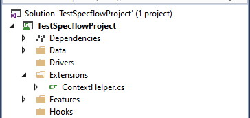

id: specflow-advanced-scenarios
summary: A lab to create more advanced SpecFlow scenarios using custom step bindings.
categories: Automated Testing, SpecFlow
environment: Web
status: Draft
authors: Zoe Dawson and Matthew Hoy

# Advanced Scenarios

## Data Setup - Getting the CRM Context

The Capgemini Bindings do not currently have a way to access the Dynamics OrganisationServiceContext, so this section will show a way to retrieve it.

### Installing Dynamics NuGet Packages

Navigate to the NuGet packages for the solution and add the following: 

```
Microsoft.CrmSdk.XrmTooling.CoreAssembly
Microsoft.CrmSdk.CoreAssemblies
```

These packages provide access to the required SDK classes to connect to and update data in a Dynamics instance.

### Helper Class

As it is possible that a number of different Steps files will require access to the Dynamics context, it is useful to put this logic in a helper file that can be accessed by all step files. Create an Extensions folder in the project root and add a ContextHelper.cs file to the folder.



Next, add `: PowerAppsStepDefiner `after the class name in the file to inherit from the Capgemini Bindings class.

This class will initially require two methods, one that returns a ServiceClient based on standard user credentials, and one that returns a ServiceClient in the context of an application user, which uses a clientid and secret.

Create a method in the ContextHelper class that returns a CrmServiceClient based on the below code outline. As this class inherits from PowerAppStepDefiner, its methods will have access to helpful methods within the TestConfig class. Use the [SDK documentation](https://docs.microsoft.com/en-us/powerapps/developer/data-platform/xrm-tooling/use-connection-strings-xrm-tooling-connect) to help you.

```
public static CrmServiceClient GetServiceClient(UserConfiguration user)
{
    return new CrmServiceClient($"Replace this text with the required values to create a connection.");
}
```

Below is a sample connection string, though this will be different across different environment configurations, such as those using IFD.

```
return new CrmServiceClient($"Url={TestConfig.GetTestUrl()}; Username={user.Username}; Password={user.Password}; AuthType=Office365; RequireNewInstance=true");
```

The next method to create for this class should return a CrmServiceClient for an application user, using a clientid and secret in the connection string rather than a username and password. Using what you have learned from the above method, create a new method based on the below code outline, using a connection string for an application user. Remember to utilise the TestConfig class.

```
public static CrmServiceClient GetServiceClient()
{
    ServicePointManager.SecurityProtocol = SecurityProtocolType.Tls12;
 
    return new CrmServiceClient($"Replace this text with the required values to create a connection");
}
```

Below is a sample connection string for an application user.

```
return new CrmServiceClient($"Url={TestConfig.GetTestUrl()}; ClientId={TestConfig.ApplicationUser.ClientId}; ClientSecret={TestConfig.ApplicationUser.ClientSecret}; AuthType=ClientSecret; RequireNewInstance=true");
```

This concludes the basic functionality required for this class, though there may be other methods that would be useful to add, such as creating a ServiceClient based on a given string containing a username rather than requiring creation of a UserConfiguration object. An example of this is given below.

```
public static CrmServiceClient GetServiceClient(string user)
{
    return GetServiceClient(TestConfig.GetUser(user));
}
```

To use the ServiceClient in a Steps class and retrieve the context from it, wrap any API operations in the below using statements.

```
using (var svc = ContextHelper.GetServiceClient(TestConfig.GetUser("<user alias here>")))
using (var context = new OrganizationServiceContext(svc))
```

It is important to remember that any records created here will not be cleaned up as part of the Capgemini Bindings after test cleanup functionality.

## Using the CRM Context

Next we will be practicing using the CRM Context to set up data required for tests. In this scenario, we will be deactivating a contact as part of a Given step and validating that it appears in the “Inactive Contacts” view. In a real world scenario, data setup would be far more complex, involving updating multiple records to advance in the business process in order to reach the precondition for the user story.

First, create a SpecFlow Step Definition file named “DataSetupSteps.cs” in the Steps folder of the project. Delete the auto generated steps and write a new Given step method declaration based on the following: 

```
Given a contact has been deactivated
```

Within this method, use the TestDriver class to retrieve the EntityReference of the ‘a contact’ entity, then use the ServiceClient to execute a SetStateRequest to deactivate the contact. Use the SDK Documentation to help you.

```
[Given("a contact has been deactivated")]
public void GivenContactIsDeactivated()
{
    var contact = TestDriver.GetTestRecordReference("a contact");
    using (var svc = ContextHelper.GetServiceClient(TestConfig.GetUser("a basic user")))
    using (var context = new OrganizationServiceContext(svc))
    {
        var updateStatus = new SetStateRequest()
        {
            EntityMoniker = contact,
            State = new OptionSetValue(1),
            Status = new OptionSetValue(2),
        };
 
        context.Execute(updateStatus);
        context.SaveChanges();
    }
}
```

Once the step has been created, it can now be used in scenarios. Create a new scenario in the ContactManagement feature file named “Basic user validates inactive contacts view” based on the below user story.

```
Given I log into the app as a basic user
And I create a contact
And the contact has been deactivated
When I navigate to the Contacts subarea
And I select the Inactive Contacts view
Then I can see the contact
```

Below is a sample scenario for the above user story:

```
Scenario: Basic user validates inactive contacts view
	Given I am logged in to the 'UI Test App' app as 'a basic user'
	And I have created 'a contact'
	And a contact has been deactivated
	When I open the sub area 'Contacts' under the 'Organisation Details' area
	And I switch to the 'Inactive Contacts' view in the grid
	Then the grid contains 'a contact'
```

Now update this step to work for any alias passed to the step. Below is a sample of how this could be implemented.

```
[Given("'(.*)' has been deactivated")]
public void GivenContactIsDeactivated(string recordAlias)
{
    var recordRef = TestDriver.GetTestRecordReference(recordAlias);
    using (var svc = ContextHelper.GetServiceClient(TestConfig.GetUser("a basic user")))
    using (var context = new OrganizationServiceContext(svc))
    {
        var updateStatus = new SetStateRequest()
        {
            EntityMoniker = recordRef,
            State = new OptionSetValue(1),
            Status = new OptionSetValue(2),
        };
 
        context.Execute(updateStatus);
        context.SaveChanges();
    }
}
```

## Writing Custom Steps

When using SpecFlow on a project, it is expected that you will be able to write custom steps to expand on those of EasyRepro and the Capgemini Bindings. At the time of writing, there are some areas of the Dynamics UI that are not compatible with EasyRepro, such as editable grids and certain dialog boxes. In this section you will be required to write custom steps that interact with these UI elements.

### Using XPath

One of the most common ways to interact with elements on the web page as part of SpecFlow testing is using XPath. XPath is a syntax that is used to navigate through and retrieve elements in an XML document.

### Finding the XPath of an Element

An easy way to find the XPath of an element is by opening Chrome Developer Tools, right clicking a HTML element and clicking “Copy XPath”. This XPath can then be used in the Chrome Console to return this specific element, by using the following function:

```
$x("Paste XPath here")
```

To execute this XPath in C#, the following method is used:

```
Driver.FindElement(By.XPath($"Paste XPath here"));
```

This is helpful for finding elements that are not accessible as part of the XrmApp EasyRepro object. For more information on XPath, see [here](https://www.w3schools.com/xml/xpath_intro.asp).

## Exercise 1 - Writing Custom Steps using XPath

In this exercise we will be validating the title shown on the out of the box Contact Delete Confirmation dialog.

Write a custom step in a new Steps file, which asserts that the dialog text is equal to “Contact Delete Confirmation”.

Then add a scenario using this step called “Basic user deletes a contact”. Please note that the “I select the ‘Delete’ command” should be used instead of the “I delete the record”, as the latter does not trigger the dialog to appear.

### Sample Answer

Below is a sample step and scenario for the above exercise.

```
[Then("a dialog is displayed with a title of '(.*)'")]
public void ThenADialogIsDisplayedWithTitle(string title)
{
    var actual = Driver.FindElement(By.XPath("//h1[@id='dialogTitleText']"));
    actual.Should().Be(title);
}
```

```
Scenario: Basic user deletes a contact
	Given I am logged in to the 'UI Test App' app as 'a basic user'
	And I have created 'a contact'
	And I have opened 'a contact'
	When I select the 'Delete' command
	Then a dialog is displayed with a title of 'Contact Delete Confirmation'
```
## Exercise 2 - Using Different By Selector Methods
Alongside XPath, Selenium has other types of selectors available for use. This exercise will demonstrate some of the commonly used selectors available in the By class.

For a list of all of the available selectors, refer to the Selenium page: https://www.selenium.dev/selenium/docs/api/java/org/openqa/selenium/By.html

### By.ClassName
The first selector covered by this exercise is the By.ClassName selector:

```
var element = Driver.FindElement(By.ClassName("className"));
```

This selector retrieves all elements where the 'class' attribute is equal to a given value.

### By.TagName
A useful selector for retrieving a group of elements is the By.TagName selector:

``` 
var element = Driver.FindElement(By.TagName("div"));
```

This selector retrieves all elements of a given tag. Write a step to run for the following line:
```
Then I can see a 'Account Name' label
```

Use By.TagName to retrieve all  label elements, then validate whether the given value appears in the list of labels.

Test this on the Accounts view, and validate that the Account Name label is displayed.

### Sample Answer
```
[Then("I can see a '(.*)' label")]
public void ThenISeeLabel(string labelName)
{
    var inputs = Driver.FindElements(By.TagName("label")).Where(x => x.Text == labelName);
    inputs.Count().Should().Be(1);
}
```

### By.CssSelector
The By.CssSelector is similar to the XPath selector in that it allows elements to be retrieved via a particular selection notation. In this case, patterns used by CSS are used to retrieve elements matching the specified criteria. Full documentation on CSS selectors can be found at https://www.w3schools.com/cssref/css_selectors.asp

Write a step for the following line:

``` 
Then I can see 13 editable inputs
```

The step should retrieve all editable inputs on a form using By.CssSelector and validate that the number of inputs retrieved matches the number specified in the step parameter. To find the appropriate CSS selector to use, check the CSS selector reference linked above to find a selector that only returns read/writeable input tags.

Test this step by opening the account form and validating that there are thirteen editable inputs.

### Sample Answer
```        
[Then("I can see (.*) editable inputs")]
        public void ThenISeeLabel(int inputCount)
{
    var inputs = Driver.FindElements(By.CssSelector("input:read-write")).Count;
    inputs.Should().Be(inputCount);
}
```

### By.Id
For accessing a specific element where the ID is known, the By.Id selector can be used. Use this selector to validate that the timeline on the Account form is visible. Write the below step to validate the account form:

```
I can see the timeline
```

### Sample Answer
```
[Then("I can see the timeline")]
public void ThenISeeTimeline()
{
    var timeline = Driver.FindElement(By.Id("Timeline"));
    timeline.Displayed.Should().Be(true);
}
```

## Exercise 3 - Web Driver Extension Methods
The Web Driver has various extension methods courtesy of EasyRepro available to help traverse common scenarios found within Dynamics. These methods help to avoid errors and flakiness in tests by cleanly handling common problems such as the test asserting validations before the page has finished loading, which would mean that the web element it needs to assert against might not be available yet on the page.

In this exercise, we will test this scenario:
```
Scenario: There is a flyout
	Given I am logged in to the 'Customer Service Hub' app as 'a basic user'
	When I open the sub area 'Accounts' under the 'Service' area
	Then there is a flyout called 'Export to Excel'
```

For this test to work, we need to add a new binding called "Then there is a flyout called 'Export to Excel' to a `[Step Bindings]` class.

```
[Then("there is a flyout called '(.*)'")]
public void ThereIsAFlyoutCalled(string flyoutName)
{
    var flyoutCommand = Driver.FindElement(By.XPath($"//button[@aria-label='{flyoutName}']"));
    flyoutCommand.Text.Should().Be(flyoutName);
}
```

This binding will find the desired flyout button in theory. However, the potential flaw with this binding is that the flyout button might not actually be available to click. This introduces a problem to our test which results in it being unreliable as it may occassionally fail if the page does not load quick enough. To protect against this, we can opt to use an extension method for the Web Driver that is provided by EasyRepro called `WaitUntilAvailable`. This will help handle exceptions caused by elements that have not loaded, and will retry the operation for us. Replace the line:

```
var flyoutCommand = Driver.FindElement(By.XPath($"//button[@aria-label='{flyoutName}']"));
```
With this:
```
var flyoutCommand = Driver.WaitUntilAvailable(By.XPath($"//button[@aria-label='{flyoutName}']"));
```

### Additional extension methods
There are other methods that can be used to help us with a variety of Dynamics specific scenarios:
- WaitUntilClickable
- WaitUntilVisible
- WaitForTransaction
- WaitUntil
- RepeatUntil
- ClickWhenAvailable
- ClickWhenVisible
- Click
- DoubleClick

Understanding how to use these methods is useful when writing custom bindings as they will help to avoid unreliable tests. Behind the scenes, they are all ultimately using `FindElement` from Selenium, but they extend the functionality by adding additional logic to prevent errors and to carry out common actions.

Overuse of these methods is not necessary. FindElement is a suitable approach a lot of the time. Understanding the context of your test is vital when considering whether to use these extension methods. Overuse of them will lead to small overheads and slower execution test time. On larger scale projects, this can add up to additonal minutes of test execution time when executing a full suite of acceptance tests.

## Exercise 4 - Handling Asynchronous Operations
Sometimes there may be a need to handle an operation that is asynchronous. Examples of this include, but are not limited to:
- Waiting for the output of async workflows
- Waiting for the output of a flow
- Waiting for Out Of the Box record generation to complete, such as Work Order Service Task generation in the Field Service App.
- Waiting for the page to load
- UI elements that have processes attached to them such as Flyout Menus which must query Dynamics for the available options.

This exercise will cover the use of various Wait function from the Selenium Web Driver that can be used to handle these async operations.

## Exercise 5 - Managing IFrames
An IFrame (Inline Frame) is an HTML document embedded inside another HTML document on a website. Within Dynamics, this can be seen on the email form. This exercise will involve creating an email, filling in information and validating the content of the form. IFrames are currently not covered by the Capgemini SpecFlow Bindings, so this exercise will use custom XPath selectors.

First, create a new steps C# file and add a new step called using the following binding:

```
When I enter 'test text' into the email body
```

### Sample Answer


## Exercise 6 - Traversing the Node Tree
When writing tests it is important that selectors always retrieve the correct node, even when run in different contexts to the original test scenario the selector was written to fulfil. A way to achieve this is by using the tree structure of HTML to only look for nodes within the area of the page they are expected to be found in. This avoids accidentally retrieving a different element that also satisfies the requirements of the selector being used. There are two main ways of traversing the node tree - using more complex XPath that validates multiple levels of a node hierarchy, or retrieving a parent element and then using a selector within the context of that element.

### Use Case
A good example of when node hierarchy is important is when validating that a field appears in a certain section on a form. This exercise will cover using both hierarchical XPath and using selectors in a given element's context. Use the below line to write a step that validates that a given field is visible in a given section.

```
Then I can see the 'First Name' field in the 'GENERAL INFORMATION' section
```

### Using XPath
XPath can be chained to validate parent and child nodes by simply adding the XPath to validate the next level of the tree onto the end of the XPath for the node before it. For example, running the below XPath on the Contact form in Chrome Dev Tools will return all section tags that are children of the div tag with a label of "Summary" (the "Summary" tab). Note that the XPath can be extended to continue down the hierarchy by selecting all child nodes of the section tags using the "/" symbol. Nodes can also be filtered using the square bracket syntax at any level of the hierarchy, not just the first level.
```
$x("//div[@aria-label='Summary']/section")
```
The above XPath selects direct children of the Summary div - if all descendants are required, "//" should be used instead of a single "/".

Now write the step to validate that a field exists within a section using only one By.XPath call and one string of XPath. Practice traversing the tree in Chrome Dev Tools using `$x("")` to identify the correct XPath to use.

### Sample Answer
Note: There are multiple valid ways to write this XPath - the key requirements are that it always finds the correct element, does not give false positives and is parameterised to work with any value passed in the step.
```
[Then("I can see the '(.*)' field in the '(.*)' section")]
public void ThenISeeFieldInSection(string fieldName, string sectionName)
{
    var label = Driver.FindElement(By.XPath(string.Format("//section[@aria-label='{0}']//label[text()='{1}']", sectionName, fieldName)));
    label.Displayed.Should().Be(true);
}
```
### Using Element Context
It may not always be appropriate to use one string of XPath to traverse the node tree; sometimes it will be required to validate multiple levels of the tree separately, so it is important to be able to retrieve intermediate nodes, validate them and then use them to retrieve nodes further down the tree. This is done by first retrieving an intermediate node, then calling a By selector on the returned IWebElement.

First, update the above `ThenISeeFieldInSection()` method to retrieve the section with the given name within the Summary tab on the contact form. Then validate that the section is displayed. Then call FindElements on the section node object to only have the XPath retrieve nodes in the context of the section node. Pass an XPath selector to this method that returns the label node with a given text value. Finally, assert that the label is visible. Test that the step still works when run against the contact form.

### Sample Answer
```
[Then("I can see the '(.*)' field in the '(.*)' section")]
public void ThenISeeFieldInSection(string fieldName, string sectionName)
{
    var section = Driver.FindElement(By.XPath(string.Format("//div[@aria-label='Summary']//section[@aria-label='{0}']", sectionName)));
    section.Displayed.Should().Be(true);
    var label = section.FindElement(By.XPath(string.Format("//label[text()='{0}']", fieldName)));
    label.Displayed.Should().Be(true);
}
```

